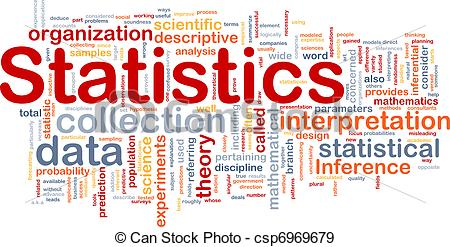
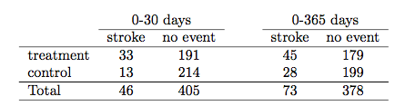
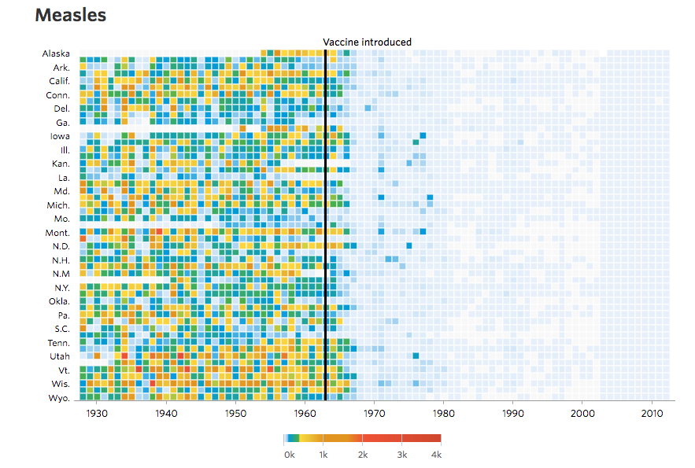

## Introdução {.build}

> * Em 1920, estudando dados de produtividade de cultivo, [Ronald Fisher](http://en.wikipedia.org/wiki/Ronald_Fisher) formou a base da estatística moderna.

> * Em 1925, Fisher escreveu o livro [Statistical Methods for Research Workers](http://en.wikipedia.org/wiki/Statistical_Methods_for_Research_Workers) para biólogos com problemas estatísticos similares aos que ele encontrou trabalhando com experimentos agrícolas em [Rothamsted](http://www.rothamsted.ac.uk).

> * Tópicos do livro: teste-t, correlação, teste qui-quadrado, análise de variância e regressão. 

* Ainda hoje, estes são os principais tópicos de cursos de metodologia estatística. 

## Introdução {.build}

<center>

</center>

A estatística é um conjunto de técnicas que permite, de forma sistemática, organizar, descrever, analisar e interpretar dados oriundos de estudos ou experimentos, realizados em qualquer área do conhecimento.
            
            
Estatística é a arte do aprendizado através de dados. 


## Por que usar métodos estatísticos? {.build}


> Três aspectos principais da estatística:


> * **Planejamento**: planejar como obter os dados para responder às perguntas de interesse.

> * **Descrição**: resumir os dados obtidos.

> * **Inferência**: tomar decisões e fazer predições baseando-se nos dados.

 
## Por que usar métodos estatísticos? {.build}
   
> Os tópicos de estudo de um certo pesquisador são tão diversos quanto as perguntas de interesse.

> No entanto, muitas vezes esses estudos podem ser realizados com técnicas simples de amostragem, análise de dados e conceitos fundamentais de inferência estatística.

## Estudo de Caso: stents e prevenção de AVC {.build}

> Problema comum em medicina: como avaliar a eficácia de um procedimento médico?

> [Estudo](http://www.nejm.org/doi/full/10.1056/NEJMoa1105335): [stents](http://www.nhlbi.nih.gov/health/health-topics/topics/stents) são eficazes no tratamento de pacientes com risco de Acidente Vascular Cerebral (AVC)?

> Stents são usados para a recuperação de pacientes que já sofreram AVC.

## Estudo de Caso: stents e prevenção de AVC
<center>

<figcaption>Figura: Stents no tratamento de AVC </figcaption>
</center>

## Estudo de Caso: stents e prevenção de AVC {.build}

> Os pesquisadores do estudo investigaram se havia benefícios também para pacientes com risco de AVC.

> * Pergunta de interesse: 

> O uso de stent reduz o risco de AVC?

> * Os pesquisadores coletaram dados de 451 pacientes com risco de AVC que se voluntariaram para o estudo.

> Cada paciente foi alocado aleatoriamente em um dos grupos:

> * **Grupo de Tratamento** - paciente recebe stent e medicação.

> * **Grupo Controle** - paciente recebe a mesma medicação do grupo tratamento, mas não recebe stent.

## Estudo de Caso: stents e prevenção de AVC {.build}

> Cada paciente foi avaliado em duas ocasiões: primeiros 30 dias e após 1 ano.

<center></center>

> Avaliar cada paciente individualmente desta planilha de dados é eficaz?

> Como poderíamos resumir?

## Estudo de Caso: stents e prevenção de AVC {.build}

<center></center>

> 33 pacientes do grupo tratamento tiveram um AVC durante os primeiros 30 dias.

> Dentre os 224 pacientes do grupo tratamento, 45 tiveram AVC durante o primeiro ano.

> Qual a proporção de pacientes do grupo tratamento que sofreram AVC durante o primeiro ano?

> $$45/224=`r round(45/224,2)` = `r round(45/224,2)*100`\%$$


```{r,echo=FALSE,message=FALSE,eval=FALSE}

trinta <- data.frame(Grupo=c("Tratamento","Controle","Tratamento","Controle"),Infarto=c("sim","sim","não","não"),Freq=c(33,13,191,214))
trintaLong <- data.frame(Grupo=rep(c("Tratamento","Tratamento","Controle","Controle"),times=c(33,191,13,214)),Infarto=rep(c("sim","não","sim","não"),times=c(33,191,13,214)))


library(ggplot2)

g<-ggplot(trintaLong,aes(x = Grupo,fill=Infarto)) + 
  geom_bar(position=position_dodge(),aes(y = ..count..)) + 
  ylab("Número de Pacientes")+
  scale_x_discrete("Grupo") +
  scale_fill_discrete(name ="AVC?")+theme(axis.text.x = element_text(face="bold", hjust = 1,size=12,color="black"),axis.text.y = element_text(face="bold", hjust = 1,size=12,color="black"))
print(g)

g<-ggplot(trintaLong,aes(x = Grupo,fill=Infarto)) + 
  geom_bar(position="fill") + 
  ylab("Proporção de Pacientes")+
  scale_x_discrete("Grupo") +
  scale_fill_discrete(name ="AVC?")+theme(axis.text.x = element_text(face="bold", hjust = 1,size=12,color="black"),axis.text.y = element_text(face="bold", hjust = 1,size=12,color="black"))
print(g)
```


  
## Estudo de Caso: stents e prevenção de AVC {.build}

<center></center>

> Podemos calcular **estatísticas sumárias** a partir da tabela.

> **Estatística Sumária**: número obtido a partir de informações dos dados coletados para resumí-los.

> Proporção de pacientes do grupo tratamento que sofreram AVC: 
$$45/224=`r round(45/224,2)` = `r round(45/224,2)*100`\%$$

> Proporção de pacientes do grupo controle que sofreram AVC: 
$$28/227=`r round(28/227,2)` = `r round(28/227,2)*100`\%$$

## Estudo de Caso: stents e prevenção de AVC {.build}

> No grupo tratamento, temos 8% a mais de pacientes que sofreram AVC.

> Isto está de acordo com a expectativa dos pesquisadores do estudo? (relembre a pergunta de interesse)

> 8% é uma diferença **considerável**? 

> Uma diferença de 8% poderia acontecer ao acaso, mesmo que os dois tratamentos na verdade oferecessem o mesmo risco de AVC?

> Utilizando metodologia estatística, os pesquisadores chegaram à conclusão de que stents são prejudiciais para pacientes com risco de AVC.

## Estudo de Caso: stents e prevenção de AVC {.build}
<div class="red2">
**CUIDADO!**

</div>


> Não podemos generalizar os resultados do estudo para todo tipo de paciente e todo tipo de stent.

<center></center>

# Estatística Descritiva: Introdução


## Exemplo: Dados do Censo

É mais simples olharmos gráficos ou 35.723.254 questionários?


Fonte: [http://www.censo2010.ibge.gov.br](http://www.censo2010.ibge.gov.br)

# Estatística Descritiva: Estrutura básica de dados


## Estrutura dos dados

Para que possamos resumir os dados, é importante primeiramente entender como eles são organizados e também os diversos tipos de cada variável.

<center>

</center>

## Exemplo: Hepatite {.smaller}

Fonte: [http://archive.ics.uci.edu/ml/datasets/Hepatitis](http://archive.ics.uci.edu/ml/datasets/Hepatitis)

```{r,echo=FALSE}
# http://archive.ics.uci.edu/ml/datasets/Hepatitis

dados <- read.csv("hepatitis.txt",header=FALSE)
colnames(dados) <- c("Class","Age","Sex","Steroid","Antivirals","Fatigue","Malaise","anorexia","liver big","liver firm","spleen palpable","spiders","ascites","varices","bilirubin","alk phosphate","sgot","albumin","protime","histology")

library(knitr)
kable(dados[,c(1,2,3,8,9,15,16,17,18)])
```

## Exemplo: Hepatite {.smaller}

[Descrição dos dados](http://archive.ics.uci.edu/ml/machine-learning-databases/hepatitis/hepatitis.names)

* 155 pacientes (linhas da planilha)

Colunas:

* Class: DIE, LIVE
* AGE: 10, 20, 30, 40, 50, 60, 70, 80
* SEX: male, female
* ANOREXIA: no, yes
* LIVER BIG: no, yes
* BILIRUBIN: 0.39, 0.80, 1.20, 2.00, 3.00, 4.00
* ALK PHOSPHATE: 33, 80, 120, 160, 200, 250
* SGOT: 13, 100, 200, 300, 400, 500, 
* ALBUMIN: 2.1, 3.0, 3.8, 4.5, 5.0, 6.0


## Tipos de variável

* Variável é uma condição ou característica de um elemento de estudo.

* Pode assumir valores diferentes em diferentes elementos.

* Peso, altura, curso, são exemplos de variáveis: para cada
pessoa, os valores mudam.


## Tipos de variável

<center>

</center>

## Tipos de variável{.build}

> * **Qualitativa**
>      + Nominal: Não existe ordenação (ex: sexo, estado civil, profissão)
>      + Ordinal: Existe uma certa ordem (ex: escolaridade, estágio da doença, classe social)

> * **Quantitativa**
>      + Discreta: os valores possíveis formam um conjunto finito ou enumerável (ex: número de filhos)
>      + Contínua: os valores possíveis estão dentro de um intervalo, aberto ou fechado, dos números reais (ex: peso, altura, salário)

## Tipos de variável {.build}

Coletamos três variáveis entre os alunos da classe:

* Número de irmãos
* Altura
* Se já fez algum curso de estatística anteriormente

> Qual o tipo de cada variável?


# Resumindo Dados Categóricos: Frequências e Proporções

## Dados categóricos{.build}

> O primeiro passo para resumir numericamente os dados de uma variável é olhar para todos os valores possíveis e contar quantas vezes cada um aparece.

> **Exemplo**: No conjunto de dados do exemplo sobre hepatite, temos a variável categórica `liver big`.


Podemos fazer uma **Tabela de frequência**, ou seja, simplesmente contar quantos pacientes se encontram em cada categoria da variável `liver big`:


```{r,echo=FALSE}
addmargins(table(dados$`liver big`))
```


# Resumindo Dados Categóricos: Representação Gráfica

## Exemplo: Hepatite

Gráfico de barras das frequências

```{r,echo=FALSE}

library(ggplot2)

liver <- data.frame(Resposta=c("Não","Sim","Sem informação"),freq=c(sum(dados$`liver big`==1),sum(dados$`liver big`==2),sum(dados$`liver big`=="?")),prop=c(mean(dados$`liver big`==1),mean(dados$`liver big`==2),mean(dados$`liver big`=="?")))

ggplot(liver, aes(Resposta, freq)) +
  geom_bar(stat = "identity") +
  coord_flip() + ylab("Frequência") +xlab("Resposta")+theme(axis.text.x = element_text(face="bold", hjust = 1,size=12,color="black"),axis.text.y = element_text(face="bold", hjust = 1,size=12,color="black"))
```

## Exemplo: Doctor Who

Gráfico de barras das proporções

```{r,echo=FALSE}

ggplot(liver, aes(Resposta, prop)) +
  geom_bar(stat = "identity") +
  coord_flip() + ylab("Proporção") + xlab("Resposta")+theme(axis.text.x = element_text(face="bold", hjust = 1,size=12,color="black"),axis.text.y = element_text(face="bold", hjust = 1,size=12,color="black"))

```


# Resumindo Dados Quantitativos

## Descrevendo Dados Quantitativos{.build}

> Como estudar a distribuição de frequências de uma variável quantitativa?

> **Quantitativa Discreta:** listar todos os valores possíveis nos dados e contar quantas vezes cada valor ocorre.

> **Exemplo: Licença Médica**

> Os dados a seguir representam o número de dias de licença médica de 50 funcionários de uma fábrica nas últimas 6 semanas:

```{r,echo=FALSE}
dias <- c(2,2,0,0,5,8,3,4,1,0,0,7,1,7,1,5,4,0,4,0,1,8,9,7,0, 1,7,2,5,5,4,3,3,0,0,2,5,1,3,0,1,0,2,4,5,0,5,7,5,1)

dias
```

## Exemplo: Licença Médica

Como o número de valores distintos nos dados é pequeno, podemos usar uma tabela para apresentar a frequência de cada valor:

```{r,echo=FALSE}

freq <- as.data.frame(table(dias))
freq$prop <- round(freq$Freq/length(dias),2)
freq1 <- freq
colnames(freq1) <- c("Dias de licença","Frequência","Proporção")
rownames(freq1)<- NULL
freq1
```

## Exemplo: Licença Médica

```{r,echo=FALSE}
#barplot(freq$Freq, main="Licença Médica", xlab="Dias",  
#   ylab="Frequência",names.arg=freq$dias,col="lightblue")

#http://docs.ggplot2.org/0.9.3.1/geom_bar.html
ggplot(freq, aes(dias, Freq)) +
  geom_bar(stat = "identity", fill="blue") + 
    ylab("Frequência") + xlab("Dias de Licença") +
    theme(axis.text = element_text(face="bold", size=12, color="black"),
          axis.title = element_text(face="bold", size=12, color="black"))
```

## Exemplo: Licença Médica

```{r,echo=FALSE}
#Prop <- freq$Freq/length(dias)
#barplot(Prop, main="Licença Médica", xlab="Dias",  
#   ylab="Proporção",names.arg=freq$dias,col="lightblue")

ggplot(freq, aes(dias, prop)) +
    geom_bar(stat = "identity", fill="blue") + 
    ylab("Proporção") + xlab("Dias de Licença") +
    theme(axis.text = element_text(face="bold", size=12, color="black"),
          axis.title = element_text(face="bold", size=12, color="black"))

```

## Descrevendo Dados Quantitativos{.build}

Como estudar a distribuição de frequências de uma variável quantitativa?

> **Quantitativa Contínua:** listar todos os valores possíveis nos dados e contar quantas vezes cada valor ocorre??? É eficiente?


## Histograma{.build}

> * Ordene os dados do menor para o maior.
> * Escolha intervalos de maneira que cada observação possa ser incluída em exatamente um deles.
> * Neste curso: os intervalos são abertos à esquerda e fechados à direita $(a,b]$.
> * Construa uma tabela de frequências
> * Desenhe o gráfico: a altura corresponde à frequência do intervalo.


## Exemplo: Hepatite

Os dados a seguir representam o nível de bilirrubina de 40 pacientes:

```{r,echo=FALSE}
bili <- dados$bilirubin
bili[bili=="?"] <- NA
bili<-bili[complete.cases(bili)]
bili <- as.numeric(as.character(bili))[1:40]
bili
```

> Ordenando:

```{r, echo=FALSE}
sort(bili)
```


## Exemplo: Hepatite {.build}

Dados ordenados:

```{r, echo=FALSE}
sort(bili)
```

> Intervalos:

 * $(0,.5]$: `r sum(bili>0 & bili<=0.5)`  $\;\;\;\;\;$ $(2.5,3]$: `r sum(bili>2.5 & bili<=105)`
 * $(.5,1]$: `r sum(bili>.5 & bili<=1)` $\;\;\;\;\;$ $(3,3.5]$: `r sum(bili>3 & bili<=3.5)`
 * $(1,1.5]$: `r sum(bili>1 & bili<=1.5)` $\;\;\;\;\;$ $(3.5,4]$: `r sum(bili>3.5 & bili<=4)`
 * $(1.5,2]$: `r sum(bili>1.5 & bili<=2)` $\;\;\;\;\;$ $(4,4.5]$: `r sum(bili>4 & bili<=4.5)`
 * $(2,2.5]$: `r sum(bili>2 & bili<=2.5)` $\;\;\;\;\;$ $(4.5,5]$: `r sum(bili>4.5 & bili<=5.5)`

## Exemplo: Hepatite

```{r, echo=FALSE}
dadosBili <- data.frame(bili = bili)
##hist(bili, col="lightblue", xlab="QI", ylab="Frequência", main=" ", cex.lab=1.5, cex.axis=1.5)

ggplot(data=dadosBili, aes(dadosBili$bili)) + 
    geom_histogram(binwidth = .5, center=0.25, colour="black", fill="blue") +
    labs(x="Bilirrubina", y="Frequência") + 
    theme(axis.title = element_text(face="bold", size=12, color="black"),
          axis.text = element_text(face="bold", size=12, color="black"))
```


## Dados sobre vacinas nos EUA

No link [http://graphics.wsj.com/infectious-diseases-and-vaccines/](http://graphics.wsj.com/infectious-diseases-and-vaccines/) temos vários gráficos mostrando muito bem o efeito de vacinas ao longo dos anos para cada estado americano, para várias doenças.


<center></center>

## Leitura

* [OpenIntro](https://www.openintro.org/stat/textbook.php): seções 1.1, 1.2, 1.6, 1.7
* [Ross](http://www.sciencedirect.com/science/book/9780123743886): seções 1.1, 1.2, 1.3, 1.4, 2.1, 2.2, 2.3, 2.4


##

Slides produzidos pelos professores:

* Samara Kiihl

* Tatiana Benaglia

* Benilton Carvalho