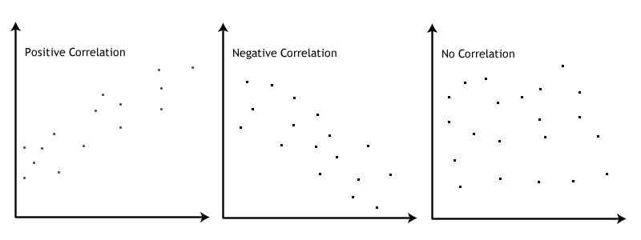
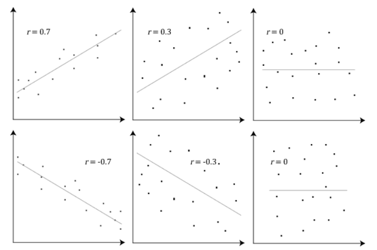
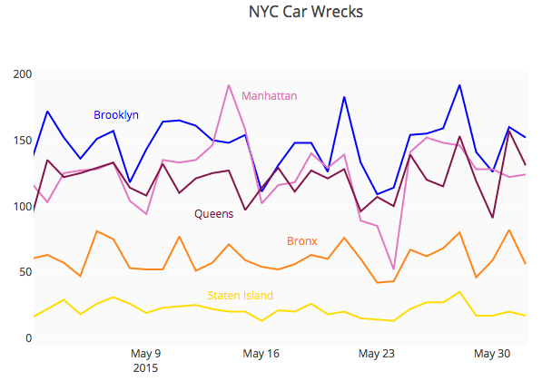
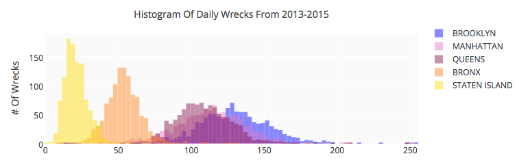

```{r, include=FALSE,warning=FALSE,message=FALSE}
library(reshape2)
library(ggplot2)
library(plotly)

# library(printr)
library(knitr)
```

# Análise Bivariada

## Associação entre duas variáveis 

Sua opinião sobre o comportamento de uma variável muda na presença de informação de uma segunda variável?

A **distribuição conjunta** das duas variáveis descreve a associação existente entre elas.

Grau de dependência: como uma variável "explica" ou se "associa" a outra.


Temos três casos:

* as duas variáveis são quantitativas

* as duas variáveis são qualitativas

* uma variável é quantitativa e a outra qualitativa

# Associação entre duas variáveis qualitativas

## Exemplo

<center>

</center>


<center>

</center>

Queremos estudar o comportamento conjunto de duas variáveis:  Endometrioma de ovário ($X$) e Adenomiose ($Y$).


## Exemplo

```{r, echo=FALSE}

x <- matrix(c(61,473,54,122), nrow=2, byrow=TRUE)
rownames(x) <- c("Endometrioma: Sim","Endometrioma: Não")
colnames(x) <- c("Adenomiose Focal","Adenomiose Difusa")

y <- data.frame(x)
y <- rbind(y,rowSums(x))
y$Total <- rowSums(y)
y <- cbind(c("Sim","Não","Total"),y)

rownames(y) <- NULL
colnames(y) <- c("Endometrioma de ovário","Adenomiose Focal", "Adenomiose Difusa", "Total")
kable(y)
```

* 61 pessoas com endometrioma de ovário e adenomiose focal.
* Na última coluna: frequência de cada nível da variável $X$.
* Na última linha:  frequência de cada nível da variável $Y$.
* Parte interna da tabela: frequências conjuntas entre $X$ e $Y$.


## Frequências Relativas

Podemos considerar também proporções condicionais (frequências relativas):

* em relação ao total de elementos;

* em relação ao total de cada linha;

* em relação ao total de cada coluna.

A proporção condicional escolhida depende do estudo que pretendemos fazer.

## Frequências Relativas

Distribuição das frequências relativas ao total da amostra.

Total da amostra é `r sum(x)`.

```{r, echo=FALSE}
kable(addmargins(prop.table(x)), digits=3)
```

8,6\% possuem endometrioma de ovário e adenomiose focal.


## Frequências relativas ao total das colunas  {.smaller}

Distribuição das frequências relativas ao total de cada coluna.

```{r, echo=FALSE}
kable(addmargins(prop.table(x, 2), 1), digits=3)
```

Entre as mulheres com adenomiose focal:

* $53\%$ apresentam endomitrioma de ovário.
 
Entre as mulheres com adenomiose difusa:

* $79,5\%$ apresentam endomitrioma de ovário.


Permite comparar a distribuição de endometrioma ($X$) conforme o tipo de adenomiose ($Y$).


## Exemplo


```{r, echo=FALSE, eval=FALSE, fig.width=8, fig.height=4.5}
## Se quiser fazer o barplot normal trocar por 'eval=TRUE'
par(mar=c(4.1, 4.1, 1.1, 2.1))
barplot(prop.table(x, 2), xlab=" ", ylab="Proporção", main=" ",
        beside=TRUE, legend.text=TRUE, ylim=c(0, .6), 
        col=c("lightgreen", "lightyellow", "lightpink"), cex.axis=1.3,
        cex.lab=1.3, cex=1.3, las=1) 
```


```{r, echo=FALSE, fig.width=10, fig.height=4.5,warning=FALSE,fig.align='center',warning=FALSE,message=FALSE}
## Definir os parâmetros dos eixos para todos os gráficos
eixos <- theme(axis.text = element_text(size=14),
               axis.title = element_text(size=14),
               legend.title = element_text(size=14, face="bold"),
               legend.text=element_text(size=14))

x.long <- melt(prop.table(x, 2), varnames=c("Endometrioma", "Adenomiose"),
               value.name="Proporção")

g <- ggplot(x.long, aes(x=Adenomiose, y=Proporção, fill=Endometrioma)) +
    geom_bar(stat="identity", width=0.7, position="dodge", colour="lightgrey") +
    scale_fill_brewer(name="Endometrioma", palette="Accent") +
    xlab("") + ylim(0, 0.8) + eixos
ggplotly(g)
```


Observando o gráfico e a tabela de proporções parece haver evidências de associação entre a presença de endometrioma e o tipo de adenomiose.


## Frequências relativas ao total das linhas { .smaller}

Distribuição das frequências relativas ao total de cada linha.

```{r, echo=FALSE}
kable(addmargins(prop.table(x, 1), 2), digits=3)
```

Entre as mulheres com endometrioma de ovário:

* $88,6\%$ possuem adenomiose difusa
 

Entre as mulheres sem endometrioma de ovário:

* $69,3\%$ possuem adenomiose difusa
 


Permite comparar a distribuição do tipo de adenomiose ($Y$) conforme a presença de endometrioma ($X$).


## Exemplo


```{r, echo=FALSE, eval=FALSE, fig.width=8, fig.height=4.5,fig.align='center',warning=FALSE,message=FALSE}
par(mar=c(3.1, 4.1, 1.1, 2.1))
barplot(t(prop.table(x, 1)), xlab=" ", ylab="Proporção", main=" ",
        beside=TRUE, legend.text=TRUE, ylim=c(0, .8), 
        col=c("lightgreen", "lightyellow", "lightpink"), cex.axis=1.3,
        cex.lab=1.3, cex=1.3, las=1) 
```


```{r, echo=FALSE, fig.width=10, fig.height=5,warning=FALSE,fig.align='center',message=FALSE}
x.long <- melt(prop.table(x, 1), varnames=c("Endometrioma", "Adenomiose"),
               value.name="Proporção")

g <- ggplot(x.long, aes(x=Endometrioma, y=Proporção, fill=Adenomiose))+
    geom_bar(stat="identity", width=0.7, position="dodge", colour="lightgrey") +
    scale_fill_brewer(name=" ", palette="Accent") +
    xlab("") + ylim(0, 1) + eixos
ggplotly(g)
```


# Associação entre duas variáveis quantitativas

## Associação entre duas variáveis quantitativas

Associação entre duas variáveis **qualitativas**: comparar proporções condicionais.

Associação entre duas variáveis **quantitativas**: comparamos como a mudança de uma variável afeta a outra variável.


# Diagrama de dispersão

## Exemplo: Tempo de serviço e total de clientes

Agente | Anos de Serviço ($X$) | Nº de Clientes ($Y$)
-------|-----------------------|--------------------------
A | 2 | 48 
B | 4 | 56 
C | 5 | 64 
D | 6 | 60 
E | 8 | 72 
Total | 25 | 300 

## Exemplo: Tempo de serviço e total de clientes

```{r, echo=FALSE, fig.height=4.5, fig.width=7,warning=FALSE,fig.align='center',message=FALSE}
x <- c(2, 4, 5, 6, 8)
y <- c(48, 56, 54, 60, 72)
dados <- data.frame(x=x, y=y)

library(RColorBrewer)
mycol <- brewer.pal(8, "Dark2")

g <- ggplot(dados, aes(x, y)) + 
    geom_point(col=mycol[1], size=3) + 
    xlab("Tempo de serviço (anos)") + ylab("Número de clientes") + eixos
ggplotly(g)
```

O gráfico indica uma possível dependência linear positiva entre as variáveis anos de serviço e número de clientes.

## Exemplo: Renda e gasto com assistência médica

* Renda Mensal Bruta ($X$)

* $\%$ da Renda gasta com Assistência Médica ($Y$)


```{r, echo=FALSE}
x <- c(12, 16, 18, 20, 28, 30, 40, 48, 50, 54)
y <- c(7.2, 7.4, 7, 6.5, 6.6, 6.7, 6, 5.6, 6, 5.5)

data <- data.frame(Familia=c("A","B","C","D","E","F","G","H","I","J"), X=x, Y=y)

data
```

## Exemplo: Renda e gasto com assistência médica

```{r, echo=FALSE, fig.height=4.5, fig.width=7,warning=FALSE,message=FALSE,fig.align='center'}
g <- ggplot(data, aes(X, Y)) + 
    geom_point(col=mycol[1], size=3) +
    labs(x="Renda Bruta", y="% da renda gasta com assistência") + eixos
ggplotly(g)
```

Nesse caso, a dependência entre $X$ e $Y$ parece ser linear negativa.


## Coeficiente de Correlação 

* **Objetivo:** obter uma medida que permita quantificar a dependência que pode existir entre duas variáveis (positiva, negativa, muita ou pouca).

* Dado $n$ pares de observações $(x_{1},y_{1}),(x_{2},y_{2}),...,(x_{n},y_{n})$: 
$$Corr(X,Y)=\frac{1}{n-1}\sum_{i=1}^{n}\left(\frac{x_{i}-\bar{x}}{s_x}\right)\left(\frac{y_{i}-\bar{y}}{s_y}\right)$$
onde $s_x$ é o desvio padrão de $X$ e $s_y$ é o desvio padrão de $Y$.

* Essa medida leva em consideração todos os desvios $(x_{i}-\bar{x})$ e $(y_{i}-\bar{y})$ padronizados da forma $z_{x_i}=\frac{x_{i}-\bar{x}}{s_x}$ e $z_{y_i}=\frac{y_{i}-\bar{y}}{s_y}$.

* Interpretação: $z_{x_i}$ indica o número de desvios-padrão que a observação $x_i$ está afastada da média de X.


## Propriedades 

* $-1 \leq Corr(X, Y) \leq 1$

* $Corr(X, Y)$ próxima de 1: $X$ e $Y$ estão positivamente associadas e o tipo de associação entre as variáveis é linear.

* $Corr(X, Y)$ próxima de -1: $X$ e $Y$ estão negativamente associadas e o tipo de associação entre as variáveis é linear.

Se $z_{x}$ e $z_y$ têm o mesmo sinal, estamos somando um termo positivo na expressão da correlação. 

Se $z_{x}$ e $z_y$ têm sinais opostos, estamos somando um termo negativo na expressão da correlação. 

Correlação é a média dos produtos de $z_x$ e $z_y$.


## Exemplo: Tempo de serviço e total de clientes 

Agente | Anos de Serviço ($X$) | Nº de Clientes ($Y$)
-------|-----------------------|--------------------------
A | 2 | 48 
B | 4 | 56 
C | 5 | 64 
D | 6 | 60 
E | 8 | 72 
Total | 25 | 300 

Anos de Serviço ($X$): $\quad \bar{x}=5 \quad \mbox{e} \quad s_x=2.24$

Nº de Clientes ($Y$): $\quad \bar{y}=60 \quad \mbox{e} \quad s_y=8.94$


## Exemplo: Tempo de serviço e total de clientes 

Agente | $X$ | $Y$ | $z_x=\frac{x_{i}-\bar{x}}{s_x}$ | $z_y=\frac{y_{i}-\bar{y}}{s_y}$ | $z_x\times z_y$
-------|-----|-----|----------------------|----------------------|-------------
A | 2 | 48 | -1.34 | -1.34 | 1.8
B | 4 | 56 | -0.45 | -0.45 | 0.2 
C | 5 | 64 | 0 | 0.45 | 0 
D | 6 | 60 | 0.45 | 0 | 0 
E | 8 | 72  | 1.34 | 1.34 | 1.8 

$$Corr(X, Y)=\frac{1}{n-1}\sum_{i=1}^{n}z_{x_i}z_{y_i}=\frac{3.8}{5-1}=0.95$$


## Exemplo: Fitbit

Número de passos diários coletados para uma pessoa usando um [Fitbit](http://en.wikipedia.org/wiki/Fitbit) durante 297 dias.


```{r, echo=FALSE, fig.height=3.5, fig.width=5,warning=FALSE,message=FALSE}
fitbit <- read.csv("Fitbit.csv", sep=";")
fitbit <- fitbit[-which(fitbit$steps<300), ] # removendo os dias em que não usou Fitbit

nf <- graphics::layout(mat = matrix(c(1, 2), 2, 1, byrow=TRUE),  height=c(1, 2))
par(mar=c(3, 4, .2, .2))
boxplot(fitbit$steps, horizontal=TRUE, outline=TRUE, ylim=c(0, 31000),
        col="lightblue", type=3)
par(mar=c(5, 4, .2, .2))
hist(fitbit$steps, nclass=20, xlab="Número de passos por dia",
     ylab="Frequência", col="lightblue", main="", xlim=c(0, 31000), las=1)
abline(v=mean(fitbit$steps), col="red", lty=2, lwd=2)
```


Qual é maior? Média ou mediana?

Média é `r round(mean(fitbit$steps),0)` e mediana é `r round(median(fitbit$steps),0)`.


## Exemplo: Fitbit 

Além do total de passos, Fitbit também registra o tempo gasto em cada tipo de atividade.

Há relação entre o total de passos e o tempo gasto em atividade intensa?


```{r, echo=FALSE, fig.height=3.5, fig.width=5.5,warning=FALSE,message=FALSE,fig.align='center'}
g <- ggplot(fitbit, aes(steps, minutesVeryActive)) + 
    geom_point(col=mycol[1], size=3, alpha=0.6) +
    labs(x="Número de Passos", y="Tempo (min) de atividade intensa") + eixos
ggplotly(g)
```


Correlação: `r round(cor(x=fitbit$steps, y=fitbit$minutesVeryActive), 2)`


## Exemplo: Fitbit 

Há relação entre o total de passos e o tempo (em minutos) de sedentarismo?


```{r, echo=FALSE, fig.height=4, fig.width=6,warning=FALSE,message=FALSE,fig.align='center'}

fitbit2 <- subset(fitbit, minutesSedentary > 1000)
g <- ggplot(fitbit2, aes(steps, minutesSedentary)) + 
    geom_point(col=mycol[1], size=3, alpha=0.6) +
    labs(x="Número de Passos", y="Tempo (min) sedentário") + eixos
ggplotly(g)
```


Correlação: `r round(cor(x=fitbit$steps[fitbit$minutesSedentary > 1000], y=fitbit$minutesSedentary[fitbit$minutesSedentary > 1000]), 2)`


## Exemplo: Fitbit

Baseado na altura, peso e gênero, o Fitbit estima o comprimento de cada passo.

Há relação entre o total de passos e distância percorrida?

```{r, echo=FALSE, fig.height=3.5, fig.width=5.5,warning=FALSE,message=FALSE,fig.align='center'}

g <- ggplot(fitbit, aes(steps, distance)) + 
    geom_point(size=3, colour=mycol[1], alpha=0.6) +
    labs(x="Número de Passos", y="Distância (km)") + eixos
ggplotly(g)
```

Correlação: `r round(cor(x=fitbit$steps, y=fitbit$distance), 2)`


## Correlação

<center></center>


## Correlação

<center></center>


## Cuidado: correlação e *outliers* {.smaller}

<center></center>

**Fonte**: [http://simplystatistics.org/2015/08/12/correlation-is-not-a-measure-of-reproducibility/](http://simplystatistics.org/2015/08/12/correlation-is-not-a-measure-of-reproducibility/)


## Cuidado: correlação não implica causa!

<center></center>


## Consumo de Queijo e Morte com Lençol {.smaller}

<center></center>

**Fonte:** [http://www.tylervigen.com/spurious-correlations](http://www.tylervigen.com/spurious-correlations)


## Taxa de analfabetismo e mortalidade infantil {.smaller}

<center></center>

Mortalidade: número de mortes de crianças de até 5 anos por mil nascidos vivos. 

Analfabetismo: % de analfabetos na população de 18 anos ou mais.

**Fonte:** [http://blog.estadaodados.com/analfabetismo-mortalidade/](http://blog.estadaodados.com/analfabetismo-mortalidade/)


## Cuidado: Correlação não implica causa!

<center></center>


# Associação entre qualitativa e quantitativa


## Exemplo

<center>

</center>


<center>

</center>


## Exemplo: Acidentes de carro em NY {.smaller}
**Variável quantitativa:** número de acidentes de carro diários

**Variável qualitativa:** região de NY

<center></center>


## Histogramas dos acidentes de carro diários por região de NY

<center></center>


## Boxplots dos acidentes de carro diários por região de NY {.smaller}

<center></center>

**Fonte:** [https://plot.ly/4916/~etpinard/](https://plot.ly/4916/~etpinard/)


## Leituras

* [OpenIntro](https://www.openintro.org/stat/textbook.php): seções 1.6, 1.7
* [Ross](http://www.sciencedirect.com/science/book/9780123743886): seções 2.5, 3.7
* [Clinical profiles of 710 premenopausal women with
adenomyosis who underwent hysterectomy](http://onlinelibrary.wiley.com/doi/10.1111/jog.12211/full)
* [Online Dashboards: Eight Helpful Tips You Should Hear From Visualization Experts](http://blog.plot.ly/post/123617968702/online-dashboards-eight-helpful-tips-you-should)

<center></center>


## 

Slides produzidos pelos professores:

* Samara Kiihl

* Tatiana Benaglia

* Benilton Carvalho

* Rafael Maia
