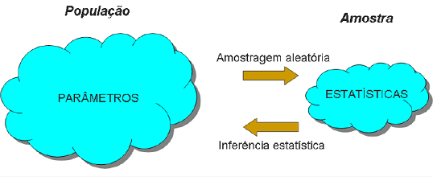
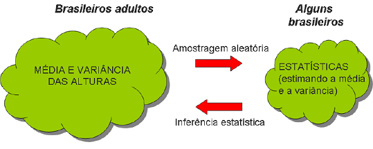

# Fundamentos de Inferência

## Introdução 

> Um dos principais objetivos da Estatística é tirar conclusões a partir dos dados.

> Dados em geral consistem de uma amostra de elementos de uma população de interesse.

> O objetivo é usar a amostra e tirar conclusões sobre a população.

> Quão confiável será utilizar a informação obtida apenas de uma amostra para concluir algo sobre a população?


## Inferência Estatística 

<center></center>

**Variável Aleatória**: Característica numérica do resultado de um experimento.

**População**: todos os elementos ou resultados de um problema que está sendo estudado.

**Amostra:** qualquer subconjunto da população que contém os elementos que podem ser observados e é onde as quantidades de interesse podem ser medidas. 


## Inferência Estatística 

<center></center>

**Parâmetros**: Característica numérica (desconhecida) da distribuição dos elementos da população.

**Estimador/Estatística**: Função da amostra, construída com a finalidade de representar, ou estimar um parâmetro de interesse na população. 

**Estimativa**: Valor numérico que um estimador assume para uma dada amostra.


## Estatística

Seja $X_{1},...,X_{n}$ uma amostra, $T=f(X_{1},...,X_{n})$ é uma estatística.

Exemplos:

* $\bar{X}_{n}=\frac{1}{n}\sum_{i=1}^{n}X_{i}=\frac{1}{n}(X_{1}+...+X_{n})$: a média amostral é uma estatística. 

* $X_{(1)}=min\{X_{1},...,X_{n}\}$.

* $X_{(n)}=max\{X_{1},...,X_{n}\}$.

* $X_{(i)}$ é o i-ésimo valor da amostra ordenada. 

* Note que uma estatística é uma função que em uma determinada amostra assume um valor específico (estimativa).


## Estatística

*  Para que serve uma estatística?  Para "estimar" os valores de uma distribuição, ou características de uma população. 

*  **População:**

    *  $\mbox{média}_{P}$.
    *  $\mbox{variância}_{P}$.

*  **Amostra:** 

    *  $\mbox{média}_{A} = \sum_{i=1}^{n}\frac{X_{i}}{n}$ "estima" a $\mbox{média}_{P}$. 
    *  $\mbox{variância}_{A} = \sum_{i=1}^{n}\frac{(X_{i}-\mbox{média}_{A})^{2}}{n}$ "estima" a $\mbox{variância}_{P}$


## Exemplo

Temos interesse em conhecer a média e variância das alturas dos brasileiros adultos. Sabemos que a distribuição das alturas pode ser representada por um modelo normal. 

> Solução 1: Medir a altura de todos os brasileiros adultos.

> Solução 2: Selecionar de forma aleatória algumas pessoas (amostra), analisá-las e inferir propriedades para toda a população.

<center></center>


## Exemplo {.build}

Seja $\theta$ a proporção de alunos na Unicamp que concorda com a presença da PM no campus.

> *  Inviável perguntar para todos os estudantes: coleta-se uma amostra. 

> *  Planejamento amostral:  obter uma amostra aleatória simples de tamanho $n=100$ alunos, sem reposição. 

> *  cada $X_{i}$, $i=1,...,100$, vai assumir o valor 1 se o aluno $i$ concorda com presença da PM, e 0 se não. 

> *  estatística: $T=\frac{X_{1}+...+X_{100}}{100}$. 

> *  uma vez que a coleta foi implementada, $T$ assume um valor, por exemplo, 0.63, que será usado para estimar $\theta$, ou seja, $\hat\theta=0.63$.


## Parâmetro {.build}

> *  Cada quantidade de interesse (como $\theta$ no exemplo anterior) é chamada de parâmetro da população. 

> *  Para apresentar uma estimativa de um parâmetro ($\hat\theta$), devemos escolher uma estatística ($T$). 

> *  Note que da maneira que o plano amostral foi executado (amostra aleatória simples), a estatística $T$ é uma variável aleatória, visto que cada vez que executarmos o plano amostral poderemos obter resultados diversos.

> *  Portanto, a estatística $T$ possui uma distribuição de probabilidade, chamada de **distribuição amostral** de T.


# Teorema Central do Limite


## Teorema Central do Limite (TCL) {.build}

**Resultado** 

Para uma amostra aleatória simples $X_{1},...,X_{n}$ coletada de uma população com média $\mu$ e variância $\sigma^{2}$, a distribuição amostral de $\bar{X}_{n}$ aproxima-se de uma **distribuição Normal** de média $\mu$ e variância $\frac{\sigma^{2}}{n}$, quando $n$ for suficientemente grande.

>

Definimos também: 

$$Z=\frac{\bar{X}_{n}-\mu}{\sigma / \sqrt{n}} \sim N(0,1)$$ 


## Teorema do Limite Central

<center></center>


## Exemplo {.build}

$X=$ resultado obtido no lançamento de um dado honesto.


$x$ | 1 | 2 | 3 | 4 | 5 | 6
----|---|---|---|---|---|----
$p(x)=P(X=x)$ | $\frac{1}{6}$ | $\frac{1}{6}$ | $\frac{1}{6}$ | $\frac{1}{6}$ | $\frac{1}{6}$ | $\frac{1}{6}$


> $E(X)=\frac{1}{6}\times(1+2+3+4+5+6)=\frac{21}{6}=3.5$

> $Var(X)=\frac{1}{6}[(1+4+9+16+25+36)-\frac{1}{6}\times(21)^{2}]=\frac{35}{2}=17.5$

> *  $X_i$: resultado do $i$-ésimo lançamento de um dado honesto.

> *  $X_i$ tem distribuição uniforme discreta $\forall i$.

> *  $\mu=E(X_i)=3.5 \qquad$ e $\qquad \sigma^2=Var(X_i)=17.5$, $\forall i$.


## Exemplo {.build .smaller}

> Se temos uma amostra aleatória simples de tamanho $n$: $X_1,X_2,\ldots, X_n$, pelo TLC sabemos que a distribuição amostral de $\bar{X}_n$ é aproximadamente Normal$\left( 3.5, \frac{17.5}{n} \right)$.


>  O primeiro histograma a seguir mostra o resultado de 10000 repetições do seguinte experimento: observar o resultado do lançamento de 1 dado. Repare que é muito próximo de uma distribuição uniforme discreta (chance 1/6 para cada resultado).

>  O segundo histograma mostra o resultado de 10000 repetições do seguinte experimento: observar a média do lançamento de 2 dados  (equivalente a observar a média de 2 lançamentos de um dado). 


>  O último histograma mostra o resultado de 10000 repetições do seguinte experimento: observar a média do lançamento de 100 dados (equivalente a observar a média de 100 lançamentos de um dado). 

>   Repare que conforme o número de dados (tamanho amostral) aumenta, a distribuição da média amostral se aproxima da distribuição normal com média 3.5 e variância cada vez menor (17.5/n).


## Exemplo

<center>
```{r, echo=FALSE, fig.width=10, fig.height=5}
par(mfrow=c(2, 3), mar=c(3, 4, 2, 2))
n1 <- sample(1:6, 10000, replace=TRUE)
barplot(table(n1), ylim=c(0, 1800), main="Média de 1 dado", col="blue", las=1)

n1a <- sample(1:6, 10000, replace=TRUE)
n2a <- sample(1:6, 10000, replace=TRUE)
n2 <- (n1a + n2a)/2
barplot(table(n2), ylim=c(0, 1800), main="Média de 2 dados", col="blue", las=1)

n1a <- sample(1:6, 10000, replace=TRUE)
n2a <- sample(1:6, 10000, replace=TRUE)
n3a <- sample(1:6, 10000, replace=TRUE)
n3 <- (n1a+n2a+n3a)/3
barplot(table(n3), ylim=c(0, 1800), main="Média de 3 dados", col="blue", las=1)


n=10
N <- matrix(sample(1:6, 10000*n, replace=TRUE), ncol=n)
nn <- apply(N, 1, mean)

#barplot(table(nn),ylim=c(0,1800),main="Média de 10 dados",col="blue")
hist(nn, xlim=c(1, 6), main="Média de 10 dados", col="blue", xlab=" ", ylab="",
     ylim=c(0, 1800), las=1)

n=50
N <- matrix(sample(1:6, 10000*n, replace=TRUE), ncol=n)
nn <- round(apply(N, 1, mean), 2)

#barplot(table(nn), ylim=c(0,1800), main="Média de 50 dados", col="blue")
hist(nn, xlim=c(1, 6), main="Média de 50 dados", col="blue", xlab=" ", ylab="",
     ylim=c(0, 1800), las=1)


n=100
N <- matrix(sample(1:6, 10000*n, replace=TRUE), ncol=n)
nn <- round(apply(N, 1, mean), 2)

#barplot(table(nn),ylim=c(0,1800), main="Média de 100 dados",col="blue")
hist(nn, xlim=c(1, 6), main="Média de 100 dados", col="blue", xlab=" ", ylab="",
     ylim=c(0, 1800), las=1)
```
</center>


## Teorema do Limite Central (TLC)

Você pode verificar o comportamento de $\bar{X}$ para vários tipos de distribuição de $X$:

https://nishantsbi.shinyapps.io/CLT_Shiny

https://gallery.shinyapps.io/CLT_mean/


# Aproximação da Distribuição Binomial pela Normal

## Aproximação da Binomial pela Normal {.build}

> *  Consideremos uma população em que a proporção de indivíduos portadores de uma certa característica seja $p$. 
$$ X_{i} = \left\{
\begin{array}{ll}
1, & \mbox{se o indivíduo i possui a característica} \\
0, & \mbox{caso contrário} \\
\end{array}
\right.$$ 

> *  $\Rightarrow$ $X_{i}\sim Bernoulli(p)$; $i=1,2,...,n$. 

> *  Se as observações são independentes: $S_{n}=X_{1}+...+X_{n}\sim  Bin(n,p)$. 

> *  Após a coleta de uma amostra aleatória simples de $n$ indivíduos, podemos considerar: 

> *  $\hat{p}=\frac{S_{n}}{n}$  (média amostral como estimador da média populacional).


## Leituras

* [Ross](http://www.sciencedirect.com/science/article/pii/B9780123743886000077): capítulo 7. 
* [OpenIntro](https://www.openintro.org/stat/textbook.php): seção 4.1.
* Magalhães: capítulo 7.


##

Slides produzidos pelos professores:

* Samara Kiihl

* Tatiana Benaglia

* Benilton Carvalho