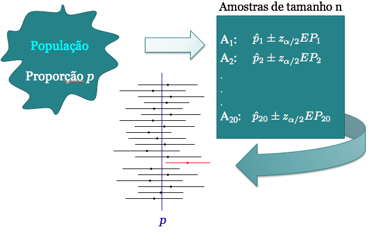
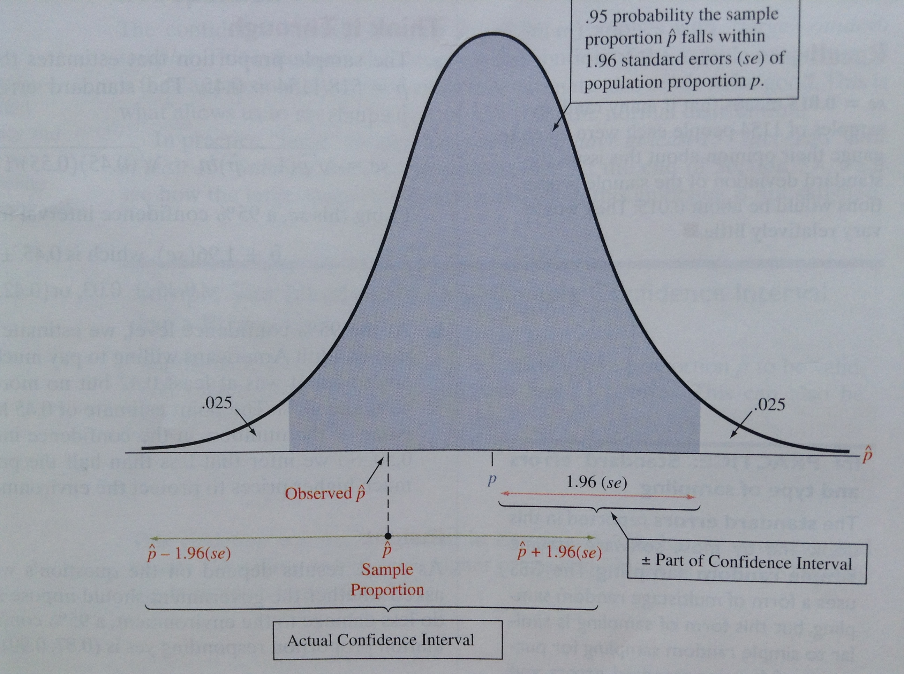

# Intervalo de Confiança

## Introdução

* Vimos que podemos utilizar uma estatística, como $\bar{X}$, para estimar um parâmetro populacional, como a média populacional $\mu$.

* Após coletarmos uma amostra aleatória calculamos $\bar{x}$, que é a nossa estimativa para $\mu$. Chamamos esta estimativa de **estimativa pontual**.

* Uma estimativa pontual fornece apenas um único valor plausível para o parâmetro. E sabemos que ela pode ser diferente para cada amostra obtida: distribuição amostral.

* O ideal é que se reporte não só a estimativa, mas também a sua imprecisão.

* Duas maneiras: fornecer a estimativa juntamente com o seu **erro-padrão** ou fornecer um intervalo de valores plausíveis para o parâmetro de interesse (**intervalo de confiança**).

## Introdução 

Suponha que queremos estimar o parâmetro populacional $\theta$ através de um intervalo.

Um intervalo de confiança (IC) para $\theta$ é sempre da forma:

$$ \mbox{estimativa} \pm \mbox{margem de erro}$$

$$\hat \theta \pm \mbox{margem de erro}$$

Sendo:

* $\hat \theta$ uma estimativa pontual de $\theta$

* **margem de erro:** quantidade que depende da distribuição amostral do estimador pontual de $\theta$, do grau de confiança pré-estabelecido e do erro padrão da estimativa


## Intervalo de Confiança como Estimativa de p 

* Seja $X_i \sim Bernoulli(p)$, $i=1, \ldots, n$. 

* Então $E(X_i)=p$ e $Var(X_i)=p(1-p)$

* Se $n$ suficientemente grande, $$\hat{p}=\frac{1}{n}\sum_{i=1}^nX_i\approx N\left(p,\frac{p(1-p)}{n}\right)$$ 

* Seja $1-\alpha$ o grau de confiança do intervalo

* Geralmente usamos $\alpha=0.05$, então o grau de confiança é $95\%$.

* Queremos encontrar um intervalo tal que a probabilidade do intervalo conter o verdadeiro valor de $p$ seja $(1-\alpha)\times 100 \%$


## Intervalo de Confiança como Estimativa de p 

Note que $p$ é desconhecido, mas a variância depende da função de $p(1-p)$, dada no seguinte gráfico: 

<center>
```{r, echo=FALSE, fig.width=4.5, fig.height=3.5}
maxp = 1
par(mar=c(5, 4, 2, 2) + .1)
curve(x*(1-x), 0, maxp, xlab = "p", ylab = "p(1-p)", type = "l", bty="l", las=1, col="blue", lwd=3, cex.lab=1.3, main=" ")
```
</center>

A função $p(1-p)$ atinge o valor máximo quando $p=1/2$, ou seja, $p(1-p) \leq \frac{1}{4}$.


## Intervalo de Confiança como Estimativa de p 

Vimos que $p(1-p)\leq \frac{1}{4}$, então erro-padrão é maximizado por: 

$$\sqrt{\frac{p(1-p)}{n}}\leq \sqrt{\frac{1}{4n}} \quad \Longleftrightarrow \quad -\sqrt{\frac{p(1-p)}{n}}\geq -\sqrt{\frac{1}{4n}}$$ 

Portanto, $0.95 \leq P\left(\hat{p}-1.96\sqrt{\frac{1}{4n}}\leq p \leq \hat{p}+1.96\sqrt{\frac{1}{4n}}\right)$. 
 
Caso geral (conservador): Um IC de $100(1-\alpha)\%$ para $p$ é dado por

<center>
$IC(p, 1-\alpha) = \left[\hat{p}-z_{\alpha/2}\sqrt{\frac{1}{4n}};\hat{p}+z_{\alpha/2}\sqrt{\frac{1}{4n}}\right]$
</center>

Veja que tivemos que escolher as quantidades $z_{\alpha/2}$ tal que:

$$P(-z_{\alpha/2}<Z<z_{\alpha/2})=1-\alpha$$

## Intervalo de Confiança como Estimativa de p 


E se usarmos a estimativa $\hat{p}$ para também estimar o erro-padrão $\sqrt{\frac{p(1-p)}{n}}$?

Podemos construir o seguinte $IC$ de  $100(1-\alpha)\%$

$$IC(p, 1-\alpha)= \left[\hat{p}-z_{\alpha/2}\sqrt{\frac{\hat{p}(1-\hat{p})}{n}};\hat{p}+z_{\alpha/2}\sqrt{\frac{\hat{p}(1-\hat{p})}{n}}\right]$$


## Como encontrar $z_{\alpha/2}$

$$P(|Z|\leq z_{\alpha/2})=P(-z_{\alpha/2}\leq Z \leq z_{\alpha/2})=1-\alpha$$
<center>
```{r, echo=FALSE, fig.height=5, fig.width=7, message=FALSE, results='hide'}
library(openintro, verbose=FALSE)
data(COL)
par(mar=c(5, 4, 1, 1) + 0.1)
normTail(M = c(-2.58, 2.58),
         df = 10,
         col = COL[1],
         xlim = 3.3 * c(-1, 1),
         ylim = c(0, 0.8),
         xlab='Desvios-padrão a partir da média')
X <- rev(seq(-4, 4, 0.025))
Y <- dt(X, 10) # makes better visual

yMax <- 0.60

lines(1.96*c(-1,1), rep(yMax,2), lwd=2)
lines(rep(-1.96,2), c(0,yMax), lty=2)
lines(rep( 1.96,2), c(0,yMax), lty=2)
text(0, yMax, '95%: de -1.96 a 1.96', pos=3)

yMax <- 0.73
lines(2.58*c(-1,1), rep(yMax,2), lwd=2)
lines(rep(-2.58,2), c(0,yMax), lty=2)
lines(rep( 2.58,2), c(0,yMax), lty=2)
text(0, yMax, '99%: de -2.58 a 2.58', pos=3)


yMax <- 0.41
lines(1.645*c(-1,1), rep(yMax,2), lwd=2)
lines(rep(-1.645,2), c(0,yMax), lty=2)
lines(rep( 1.645,2), c(0,yMax), lty=2)
text(0, yMax, '90%: de -1.64 a 1.64', pos=3)
```
</center>


## Exemplo


<center>

</center>


<center>

</center>

## Exemplo

$p$: proporção de mulheres com adenomiose na população estudada.

Podemos construir o seguinte $IC$ de  $100(1-\alpha)\%$ para $p$.

$$IC(p, 1-\alpha)= \left[\hat{p}-z_{\alpha/2}\sqrt{\frac{\hat{p}(1-\hat{p})}{n}};\hat{p}+z_{\alpha/2}\sqrt{\frac{\hat{p}(1-\hat{p})}{n}}\right]$$

```{r,echo=FALSE}
phat=734/1697
n=1697
se = sqrt(phat*(1-phat)/n)
LI=phat-1.96*se
LS=phat+1.96*se
```
No exemplo: $n = 1697$, $\hat{p}=\frac{734}{1697}=`r round(734/1697,3)`$.

Erro-padrão: $\sqrt{\frac{\hat{p}(1-\hat{p})}{n}}=\sqrt{\frac{`r round(734/1697,3)`\times(1-`r round(734/1697,3)`)}{1697}}$

$95\%$ de confiança, $\alpha=0.05$, $z_{\alpha/2}=1.96$.

$$IC(p, 95)=[`r round(LI,3)`\,;\,`r round(LS,3)`]$$


## Resumo 

* Coletamos uma amostra aleatória $X_1, X_2, \ldots, X_n$ de uma população com distribuição de Bernoulli com probabilidade de sucesso igual a $p$, portanto com média $p$ e a variância $p(1-p)$ e usamos $\bar{X}_n=\hat{p}$ para estimar $p$.

* Pelo TCL: $$\hat{p} \sim N\left(p,\frac{p(1-p)}{n}\right)$$

* Propriedade da Normal: $$Z=\frac{\hat{p}-p}{\sqrt{p(1-p)/n}} \sim N(0,1)$$
$$P(-z_{\alpha/2}<Z<z_{\alpha/2})=1-\alpha$$


## Intervalo de Confiança para $p$ 

Então, um intervalo de $100(1-\alpha)\%$ de confiança para $p$:

$$IC(p, 1-\alpha)=\left[ \hat{p} -z_{\alpha/2}\sqrt{\frac{p(1-p)}{n}}\,;\,  \hat{p} +z_{\alpha/2}\sqrt{\frac{p(1-p)}{n}}\right]$$

**Problema:** não conhecemos $p$. Portanto, usamos:

$$IC(p, 1-\alpha) = \left[ \hat{p} -z_{\alpha/2}\sqrt{\frac{\hat{p}(1-\hat{p})}{n}}\,;\,  \hat{p} +z_{\alpha/2}\sqrt{\frac{\hat{p}(1-\hat{p})}{n}}\right]$$
ou, pelo método conservador,
$$IC(p, 1-\alpha) = \left[ \hat{p} -z_{\alpha/2}\sqrt{\frac{1}{4n}}\,;\,  \hat{p} +z_{\alpha/2}\sqrt{\frac{1}{4n}}\right]$$

## Exemplo: Universitários Não Fumantes

De uma amostra aleatória de 100 alunos de uma universidade, 82 afirmaram ser não fumantes. 

Construa um intervalo de confiança de 99\% para a proporção de não fumantes entre todos os alunos da universidade.

 $\hat{p}=0.82, n=100, \alpha=0.01,$ e $z_{0.005}=2.58$

 $$
\begin{aligned}
IC_1(p, 0.99) &= \left[\hat{p} - z_{0.005}\sqrt{\frac{\hat{p}(1-\hat{p})}{n}}; \hat{p} + z_{0.005}\sqrt{\frac{\hat{p}(1-\hat{p})}{n}}\right] \\
&= \left[ 0.82 -2.58\sqrt{\frac{(0.82)(0.18)}{100}} ; 0.82 + 2.58\sqrt{\frac{(0.82)(0.18)}{100}}\right] \\
&= [0.72; 0.92]
\end{aligned}
$$

## Exemplo: Universitários Não Fumantes 

Podemos também calcular o $IC$ de 99\% pelo método conversador:
$$
\begin{aligned}
IC_2(p, 0.99) &= \left[\hat{p} - z_{\alpha/2}\sqrt{\frac{1}{4n}}; \hat{p} + z_{\alpha/2}\sqrt{\frac{1}{4n}}\right] \\
&=  \left[0.82 - 2.58\sqrt{\frac{1}{400}}; 0.82 + 2.58\sqrt{\frac{1}{400}}\right] \\
&= [0.69; 0.95]
\end{aligned}
$$

**Interpretação:** Com um grau de confiança de 99\%, estimamos que a proporção de não fumantes entre os alunos está entre 72\% e 92\% (resultado do slide anterior).

E pelo método conservador, com um grau de confiança de 99\%, estimamos que a proporção de não fumantes entre os alunos está entre 69\% e 95\%.


## Interpretação do Intervalo de Confiança

**Interpretação:** Se várias amostras forem retiradas da população e calcularmos um $IC$ de 95\% para cada amostra, cerca de 95\% desses intervalos irão conter a verdadeira proporção na população, $p$. 

**INCORRETO:** Dizer que "a probabilidade de que $p$ esteja dentro do intervalo é 95\%"

Por que incorreto? $p$ é uma constante, não é variável aleatória. Ou $p$ está no intervalo ou não está. O intervalo é que é aleatório.

## Interpretação do Intervalo de Confiança 

<center></center>

## 

<center></center>

## 

<center></center>

# Tamanho da amostra para estimar $p$

## Exemplo {.smaller}

A Datafolha quer fazer uma pesquisa de boca-de-urna para predizer o resultado de uma eleição com apenas dois candidatos.  

Irá então selecionar uma a.a. de eleitores e perguntar em quem votou. Para esta pesquisa, o Datafolha quer uma margem de erro de 4\%. Qual o tamanho de amostra necessário?

* O grau de confiança  é 95\% e $IC(p, 0.95) = \hat{p} \pm 1.96\times EP(\hat{p})$

* Erro padrão de $\hat{p}$ é $EP(\hat p) = \sqrt{p(1-p)/n}$

* Margem de erro:  $1.96 \times EP(\hat{p})=1.96\sqrt{p(1-p)/n}$

* Margem de erro desejada é 0.04. Então, o tamanho amostral necessário $n$ é:

 $$1.96\sqrt{\frac{p(1-p)}{n}}=0.04 \quad \Rightarrow \quad n=\frac{1.96^2p(1-p)}{0.04^2}$$


## Exemplo 

Problema  é que não conhecemos $p$.

Assim como para encontrar os $IC$'s, podemos usar o método conservador ou então usar informações obtidas em pesquisas anteriores (caso existam).

**Método Conservador:**

 * Lembre que $p(1-p)/n$ é a variância da  estimativa $\hat{p}$ e já vimos anteriormente que $p(1-p)\leq 1/4$. 

 * Então, $$n=\frac{1.96^2\times (1/4)}{0.04^2}=600$$


##Exemplo

**Outra alternativa**

* O Datafolha fez uma pesquisa na semana passada e o resultado foi 58\% votariam no candidato $A$ e 42\% no $B$.  

 * Podemos usar então estas estimativas: 
$$n=\frac{1.96^2\hat{p}(1-\hat{p})}{0.04^2}=\frac{1.96^2(0.58)(0.42)}{0.04^2}=585$$

 * Uma a.a. de tamanho 585 deverá resultar numa margem de erro de 4\% para um IC de 95\% para a proporção da população que vota no candidato $A$.


## Leituras

<center></center>


* [Ross](http://www.sciencedirect.com/science/article/pii/B9780123743886000089): capítulo 8. 
* [OpenIntro](https://drive.google.com/file/d/0B-DHaDEbiOGkY1FCdEJFNGV1Ym8/view): seção 4.2.
* Magalhães: seção 7.4.

##

Slides produzidos pelos professores:

* Samara Kiihl

* Tatiana Benaglia

* Benilton Carvalho

* Rafael Maia


