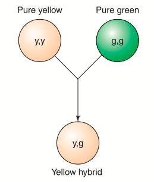
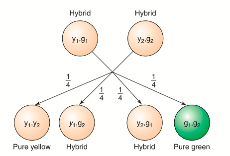
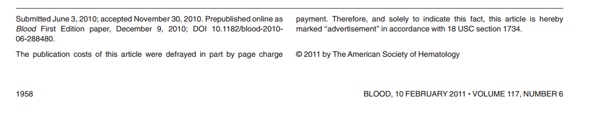
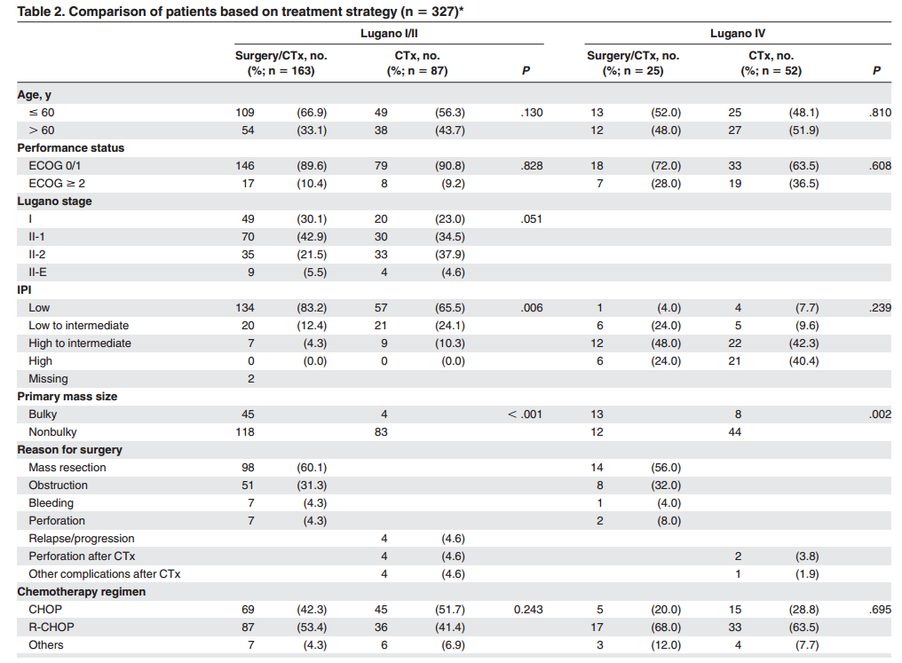

# Teste Qui-Quadrado

## Introdução {.build}

Muitas vezes, a informação da amostra coletada tem a estrutura de dados categorizados, ou seja, cada membro da população pode assumir um entre $k$ valores distintos de uma ou mais características estudadas. 

Desta forma, o conjunto de dados pode ser representado por frequências de contagens para essas categorias. 

Esse tipo de dados são muito comuns nas áreas sociais e biomédicas.

O objetivo aqui é apresentar o **teste de qui-quadrado** para dados categóricos em diferentes contextos: 

* *Teste de Aderência (ou Bondade de Ajuste)*

* *Teste de Independência*

* *Teste de Homogeneidade*


## Introdução {.build}

**Teste de Aderência:** considere uma população na qual cada membro assume qualquer um de $k$ possíveis valores de uma dada característica. Iremos verificar quão adequado uma amostra obtida dessa população se ajusta a um modelo de probabilidade proposto.

>**Teste de Independência:** considere uma população na qual cada membro é classificado de acordo com duas características distintas. iremos testar, com os dados de uma amostra desta população, se as duas características são independentes. 

Duas características serão independentes se a classificação de um membro da população de acordo com uma característica não interfere na probabilidade de classificação em relação a segunda característica desse mesmo membro.

## Introdução {.build}

**Teste de Homogeneidade:** Considere que temos duas ou mais populações e que os membro de cada população possa assumir um de $k$ possíveis valores de uma dada carcaterística. O objetivo é testar se as populações são homogêneas, isto é, que as diferentes populações tem a mesma distribuição de inidividuos para a característica estudada.


# Teste de Aderência {.build}

## Exemplo
```{r genetica, echo=FALSE}
obs <- c(AA=26, Aa=45, aa=29)
n <- sum(obs)
p0 <- c(0.25, 0.5, 0.25)

xsq <- chisq.test(obs, p=p0)
esp <- xsq$expected
res <- round(xsq$residuals^2, 2)
stat <- round(xsq$statistic, 2)

alpha <- 0.05
df <- xsq$parameter
xcrit <- round(qchisq(1-alpha, df), 3)
```

Em uma certa população uma dada característica de interesse foi estudada para `r n` descendentes, e a seguinte tabela foi gerada:

Genótipo | $AA$ | $Aa$ | $aa$ | Total
-------- | -- | -- | -- | -----
Frequência Observada | `r obs[1]` | `r obs[2]` | `r obs[3]` | `r n`


$$ $$ 

<center>
**Objetivo:** 

Verificar se a característica estudada nesta população segue o equilíbrio de Hardy-Weiberg (modelo proposto).

## Exemplo {.build}

Se o modelo teórico for adequado, a frequência esperada de descendentes para o genótipo $AA$, dentre os 100 indivíduos, pode ser calculada por:
$$`r n` \times P(AA) = `r n` \times \frac{1}{4} = `r esp[1]`$$

Da mesma forma para o genótipo $Aa$:
$$`r n` \times P(Aa) = `r n` \times \frac{1}{2} = `r esp[2]`$$

E para o genótipo $aa$:
$$`r n` \times P(aa) = `r n` \times \frac{1}{4} = `r esp[3]`$$


## Exemplo {.build}

Podemos expandir a tabela de frequências dada anteriormente com as frequências esperadas sob o modelo teórico:

Genótipo | $AA$ | $Aa$ | $aa$ | Total
-------- | -- | -- | -- | -----
Frequência Observada | `r obs[1]` | `r obs[2]` | `r obs[3]` | `r n`
Frequência Esperada  | `r esp[1]` | `r esp[2]` | `r esp[3]` | `r n` 


<center>

> **Pergunta:** 

Podemos afirmar que os valores observados estão suficientemente próximos dos
valores esperados, de tal forma que o modelo genético teórico seja adequado a esta população?

> O procedimento que responde esse tipo de pergunta é chamado de **teste de bondade de ajuste** ou **teste de aderência**.

## Teste de Aderência {.build}

Considere uma tabela de frequências, com $k \geq 2$ categorias de resultados: 

Categorias | $1$ | $2$ | ... | $k$ | Total
---------- | - | - | --- | - | -----
Frequência Observada | $O_1$ | $O_2$ | ... | $O_k$ | $n$


Sendo $O_i$ o total de indivíduos observados na categoria $i$, $i=1,2, \ldots, k$.

Seja $p_i$ a probabilidade associada à categoria $i$, $i=1,2, \ldots, k$.

O objetivo do teste de aderência é testar as hipóteses

$$\begin{aligned}
H_0: & p_1=p_{01}, \ldots , p_k= p_{0k} \\
H_a: & \mbox{existe pelo menos uma diferença}
\end{aligned}
$$
sendo $p_{0i}$ a probabilidade da categoria $i$ sob o modelo teórico e $\sum_{i=1}^k p_{0i} =1$

## Procedimento {.build}

Se $E_i$ é o total de indivíduos esperados na categoria $i$, quando a hipótese nula $H_0$ é verdadeira, então:

$$E_i = n\times p_{0i}, \quad i=1,2, \ldots, k.$$

Então, expandindo a tabela de frequências original, temos

Categorias | $1$ | $2$ | ... | $k$ | Total
---------- | - | - | --- | - | -----
Frequência Observada | $O_1$ | $O_2$ | ... | $O_k$ | $n$
Frequência Esperada | $E_1$ | $E_2$ | ... | $E_k$ | $n$


## Procedimento
Para quantificar quão distante os frequências observadas estão das frequências esperadas, usamos a seguinte estatística:

**Estatística do Teste**:
$$\chi^2=\sum_{i=1}^k \frac{(O_i-E_i)^2}{E_i} = \sum^{k}_{i=1}\frac{(n_i-np_{0i})^2}{np_{0i}}$$

Se $H_0$ é verdadeira: $\chi^2 \sim \chi^2_{k-1}$

Em outras palavras, se $H_0$ é verdadeira, a v.a. $\chi^2$ segue uma distribuição aproximadamente Qui-quadrado com $k-1$ graus de liberdade.

**Condição**: Este resultado é válido para $n$ grande e para frequências esperadas maiores ou iguais a 5.


##  Procedimento {.build}

Calcular o **valor-de-p** ou encontrar o **valor crítico**.

**Valor-de-p**: $P(\chi^2_{k-1} \geq \chi^2_{obs}),$ em que $\chi^2_{obs}$ é o valor da estatística do teste calculada a partir dos dados. 

<center>
```{r, echo=FALSE, fig.width=7, fig.height=4, message=FALSE}
library(openintro, verbose = FALSE)
data(COL)
df <- 4

ymax <- max(dchisq(0:16, df))/2

x <- seq(0, 18, length.out = 300)
y <- dchisq(x, df)

par(mar = c(4, 2, 2, 1))
plot(x, y, type = 'l', axes = FALSE, lwd=2, main = bquote("Distribuição "* chi[k-1]^2), 
     xlab="")
abline(h = 0)
axis(1)

xobs <- 11  
axis(1, at=xobs, label= bquote(chi[obs]^2))

these <- which(x >= xobs)
X <- x[c(these[1], these, rev(these)[1])]
Y <- c(0, y[these], 0)
polygon(X, Y, col = COL[1])

arrows(xobs, ymax, xobs, ymax/4, 0.1, col = COL[1])
text(xobs, ymax, labels= bquote(chi[obs]^2), pos = 3, cex = 1.2, col = COL[1])

text(xobs + 4, 0.035, labels= "valor-de-p =", pos = 3, cex = 1.2, col = COL[1])
text(xobs + 4, 0.01, labels= bquote('P('* chi[k-1]^2 >= chi[obs]^2 *')'), pos = 3, cex = 1.2, col = COL[1])
```
</center>


## Procedimento {.build}

**Valor Crítico**: Para um nível de significância $\alpha$, encontrar o valor crítico $\chi^2_{crit}$ na tabela Qui-quadrado tal que $P(\chi^2_{k-1} \geq \chi^2_{crit}) = \alpha.$

<center>
```{r, echo=FALSE, fig.width=6.5, fig.height=3, message=FALSE}
library(openintro, verbose = FALSE)
data(COL)
alpha <- 0.10

par(mar = c(4, 2, 2, 1))
plot(x, y, type = 'l', axes = FALSE, lwd=2, main = bquote("Distribuição "* chi[k-1]^2), 
     xlab="")
abline(h = 0)
axis(1)

xcrit <- round(qchisq(1-alpha, df), 3)  
axis(1, at=xcrit, label= bquote(chi[crit]^2))

these <- which(x >= xcrit)
X <- x[c(these[1], these, rev(these)[1])]
Y <- c(0, y[these], 0)
polygon(X, Y, col = COL[1])

## arrows(xcrit, ymax, xcrit, ymax/2, 0.1, col = COL[1])
## text(xcrit, ymax, labels= bquote(chi[crit]^2), pos = 3, cex = 1.2, col = COL[1])

text(xcrit + 5, 0.02, labels= expression('Área = P('* chi[k-1]^2 >= chi[crit]^2 *') = '* alpha), pos = 3, cex = 1.2, col = COL[1])
```
</center>

**Conclusão**: Rejeitamos $H_0$ se

$$\mbox{valor-de-p} \leq \alpha \quad \mbox{ou} \quad \chi_{obs}^2 \geq \chi^2_{crit}$$


## Exemplo: Genética (continuação) {.build}

Voltando no exemplo da Genética

**Hipóteses:**
$$\begin{aligned}
H_0: & \mbox{o modelo proposto é adequado} \\
H_a: & \mbox{o modelo proposto não é adequado}
\end{aligned}
$$

Que de forma equivalente, podem ser escritas como:
$$\begin{aligned}
H_0:  & \, p_1=1/4, p_2=1/2 , p_3= 1/4 \\
H_a: &  \, \mbox{ao menos umas das desigualdades não verifica}
\end{aligned}
$$
sendo $p_1=P(AA)$, $p_2=P(Aa)$ e $p_3=P(aa)$.

## Exemplo: Genética (continuação) {.build}
```{r genetica, echo=FALSE}
```

A tabela seguinte apresenta os valores observados e esperados (calculados anteriormente).

Genótipo | $AA$ | $Aa$ | $aa$ | Total
-------- | -- | -- | -- | -----
Frequência Observada | `r obs[1]` | `r obs[2]` | `r obs[3]` | `r n`
Frequência Esperada  | `r esp[1]` | `r esp[2]` | `r esp[3]` | `r n`


**Estatística do Teste**:
$$
\begin{aligned}
\chi^2_{obs} &= \sum_{i=1}^3 \frac{(O_i-E_i)^2}{E_i} = \frac{(26-25)^2}{25} + \frac{(45-50)^2}{50} + \frac{(29-25)^2}{25} \\
&= `r res[1]` + `r res[2]` + `r res[3]` = `r stat` 
\end{aligned}
$$


## Exemplo: Genética (continuação) {.build}
Sob $H_0$, a estatística $\chi^2 \sim \chi^2_2$. Veja que os graus de liberdade é o número de categorias menos 1. Então o valor-de-p é dado por:

$$\mbox{valor-de-p} = P(\chi^2_2 \geq \chi^2_{obs}) = P(\chi^2_2 \geq `r stat`) = `r round(xsq$p.value, 3)`$$
o valor crítico é:
$\chi^2_{crit} = `r xcrit`$

**Conclusão:** Para $\alpha = `r alpha`$, como valor-de-p$= `r round(xsq$p.value, 3)` > `r alpha`$, não temos evidências estatística para rejeitar a hipótese
$H_0$, isto é, essa população segue o modelo genético proposto.

Ou como $\chi^2_{obs}=`r stat` < `r xcrit` = \chi^2_{crit},$ não rejeitamos a hipótese $H_0$.

## Exemplo: Genética (continuação) {.build}
<center>
```{r, echo=FALSE, fig.width=7, fig.height=5}
library(openintro, verbose = FALSE)
data(COL)
source("../functions/ChiSquareTail.R")
## alpha <- 0.05
## df <- 2
## xcrit <- round(qchisq(1-alpha, df), 3)
xobs <- stat

ymax <- max(dchisq(0:10, df))/2

par(mar = c(4, 2, 3, 1))
ChiSquareTail(xcrit, df, c(0, 10), col = COL[1], xlab="")

arrows(xcrit, ymax, xcrit, ymax/4, 0.1, col = COL[1])
text(xcrit, ymax, labels= bquote(chi[.(paste0(df, ",", alpha))]^2 == .(xcrit)), pos = 3, cex = 1.2, col = COL[1])
text(xcrit + 2, 0.01, labels= bquote("Área = "* .(alpha)), pos = 3, cex = 1.2, col = COL[1])

axis(1, at=xobs, label= bquote(chi[obs]^2 == .(xobs)))
```
</center>


## Exemplo: Cores de Geladeira {.build}

Uma determinada marca de geladeira é vendida em cinco cores diferentes e uma pesquisa de mercado quer avaliar a popularidade das várias cores.  

As frequências abaixo são observadas para uma amostra de 300 vendas feitas num semestre.  

<center>Vendas das cinco cores das geladeiras da marca W</center>

Cor | marrom | creme | vermelho | azul | branco | total
---:|:------:|:-----:|:--------:|:----:|:------:|:-----
Frequência  | 88 | 65 | 52 | 40 | 55 | 300 

Suponha que seja de interesse testar a hipótese das cinco cores serem igualmente populares.

$$\begin{aligned}
H_0: & p_1=p_2= \ldots = p_5= 1/5 \\
H_a: & \mbox{existe pelo menos uma diferença}
\end{aligned}
$$


## Exemplo: Cores de Geladeira {.build}
```{r geladeira, echo=FALSE}
obs <- c(G1=88, G2=65, G3=52, G4=40, G5=55)
n <- sum(obs)
p0 <- rep(1/5, 5)

xsq <- chisq.test(obs, p=p0)
esp <- xsq$expected
res <- round(xsq$residuals^2, 2)
stat <- round(xsq$statistic, 2)

alpha <- 0.05
df <- xsq$parameter
xcrit <- round(qchisq(1-alpha, df), 3)
```

 Componente | marrom | creme | vermelho | azul | branco | total
----------:|:------:|:-----:|:--------:|:----:|:------:|:-----
Frequência Observada | `r obs[1]` | `r obs[2]` | `r obs[3]` | `r obs[4]` | `r obs[5]` | `r n`

Como as probabilidades das componentes na hipótese nula são todas iguais, as frequências esperadas também serão todas iguais, ou seja,
$$E_i = n\times \frac{1}{5} = `r n`\times \frac{1}{5} = `r esp[1]`, \quad i=1,2,3,4,5.$$

## Exemplo: Cores de Geladeira {.build}

Componente | marrom | creme | vermelho | azul | branco | total
----------:|:------:|:-----:|:--------:|:----:|:------:|:-----
Frequência Observada | `r obs[1]` | `r obs[2]` | `r obs[3]` | `r obs[4]` | `r obs[5]` | `r n`
Frequência Esperada  | `r esp[1]` | `r esp[2]` | `r esp[3]` | `r esp[4]` | `r esp[5]` | `r n` 
$\displaystyle \frac{(O-E)^2}{E}$ | `r res[1]` | `r res[2]` | `r res[3]` | `r res[4]` | `r res[5]` | `r stat`

**Estatística do Teste:**
$$\begin{aligned}
\chi^2=\sum_{i=1}^5 \frac{(O_i-E_i)^2}{E_i} &= `r res[1]` + `r res[2]` + `r res[3]` + `r res[4]` + `r res[5]` \\ 
&= `r stat`
\end{aligned}
$$


## Exemplo: Cores de Geladeira {.build}
Olhando na tabela qui-quadrado com `r df` graus de liberdade, para $\alpha=`r alpha`$, o valor crítico é $\chi^2_{crit} = \chi^2_{`r df`, `r alpha`} = `r xcrit`$.

<center>
```{r, echo=FALSE, fig.width=6, fig.height=3}
## alpha <- 0.05
## df <- 4
## xcrit <- round(qchisq(1-alpha, df), 3)

ymax <- max(dchisq(0:15, df))/2

par(mar = c(4, 2, 3, 1))
ChiSquareTail(xcrit, df, c(0, 15), col = COL[1], xlab="")

arrows(xcrit, ymax, xcrit, ymax/4, 0.1, col = COL[1])
text(xcrit, ymax, labels= bquote(chi[.(paste0(df, ",", alpha))]^2 == .(xcrit)), pos = 3, cex = 1.2, col = COL[1])

text(xcrit + 3, 0.01, labels= bquote("Área = "* .(alpha)), pos = 3, cex = 1.2, col = COL[1])
```
</center>

**Conclusão:** Para $\alpha = `r alpha`$, como $\chi^2_{obs}= `r stat` > `r xcrit` = \chi^2_{crit},$ rejeitamos a hipótese de que as cinco cores são igualmente populares.


## Exemplo: Tipo Sanguíneo {.build}
```{r tiposangue, echo=FALSE}
obs <- c(A=92, B=20, AB=4, O=84)
n <- sum(obs)
p0 <- c(0.41, 0.09, 0.04, 0.46)

xsq <- chisq.test(obs, p=p0)
esp <- xsq$expected
res <- round(xsq$residuals^2, 2)
stat <- round(xsq$statistic, 2)

alpha <- 0.05
df <- xsq$parameter
xcrit <- round(qchisq(1-alpha, df), 3)
```

Entre os americanos, `r p0[1]*100`% tem sangue do tipo A, `r p0[2]*100`% tem sangue tipo B, `r p0[3]*100`% tipo AB e `r p0[4]*100`% tem sangue tipo O. 

Em uma amostra aleatória de `r n` pacientes americanos com câncer de estômago, `r obs[1]` pacientes têm sangue do tipo A, `r obs[2]` do tipo B, `r obs[3]` do tipo AB e `r obs[4]` do tipo O.  

Tipo | A | B | AB | O | total
---- | - | - | -- | - | ----
Frequência Observada | `r obs[1]` | `r obs[2]` | `r obs[3]` | `r obs[4]` | `r n` 

*Essas frequências observadas trazem evidência contra a hipótese de que a distribuição do tipo sanguíneo dos pacientes é igual a distribuição dos tipos sanguíneos na população geral americana?*  

## Exemplo: Tipo Sanguíneo {.build}

$$\begin{aligned}
H_0: & p_1=`r p0[1]`, p_2=`r p0[2]`, p_3=`r p0[3]` , p_4=`r p0[4]` \\
H_a: & \mbox{existe pelo menos uma diferença}
\end{aligned}
$$


Tipo | A | B | AB | O | total
---- | - | - | -- | - | ----
Frequência Observada | `r obs[1]` | `r obs[2]` | `r obs[3]` | `r obs[4]` | `r n`
Frequência Esperada  | `r esp[1]` | `r esp[2]` | `r esp[3]` | `r esp[4]` | `r n` 
$\displaystyle \frac{(O-E)^2}{E}$ | `r res[1]` | `r res[2]` | `r res[3]` | `r res[4]` | `r stat`

**Estatística do Teste:** $\displaystyle \chi^2=\sum_{i=1}^4 \frac{(O_i-E_i)^2}{E_i} = `r stat`$


## Exemplo: Tipo Sanguíneo {.build}

<center>
```{r, echo=FALSE, fig.width=6, fig.height=3}
xobs <- stat
ymax <- max(dchisq(0:15, df))/2

par(mar = c(4, 2, 3, 1))
ChiSquareTail(xcrit, df, c(0, 15), col = COL[1])

arrows(xcrit, ymax, xcrit, ymax/4, 0.1, col = COL[1])
text(xcrit, ymax, labels= bquote(chi[.(paste0(df, ",", alpha))]^2 == .(xcrit)), pos = 3, cex = 1.2, col = COL[1])

axis(1, at=xobs, label= bquote(chi[obs]^2))
text(xcrit + 3, 0.01, labels= bquote("Área = "* .(alpha)), pos = 3, cex = 1.2, col = COL[1])
```
</center>


**Conclusão**: Como $\chi^2_{obs} = `r stat` \leq `r xcrit`= \chi^2_{`r df`, `r alpha`}$, não temos evidência para rejeitar a  hipótese nula. 

Portanto, concluímos que não há discrepância significativa entre o que foi observado e a distribuição sanguínea da população americana.


## Exemplo: Ervilhas de Mendel
<center></center>


## Exemplo: Ervilhas de Mendel 
<center></center>
*Figura: (Esquerda) Cruzamento de ervilhas puramente amarelas e puramente verdes e (Direta) cruzamento de ervilhas híbridas (Direita)*

## Exemplo: Ervilhas de Mendel {.build}
```{r mendel, echo=FALSE}
obs <- c(Amarelas=6022, Verdes=2001)
n <- sum(obs)
p0 <- c(3/4, 1/4)

xsq <- chisq.test(obs, p=p0)
esp <- xsq$expected
res <- round(xsq$residuals^2, 3)
stat <- round(xsq$statistic, 3)

alpha <- 0.05
df <- xsq$parameter
xcrit <- round(qchisq(1-alpha, df), 3)
```

Mendel fez o cruzamento de `r n` ervilhas híbridas e o resultado foram `r obs[1]` ervilhas amarelas e `r obs[2]` ervilhas verdes.  Teoricamente, cada cruzamento deve resultar em ervilha amarela com probabilidade $3/4$ e verde com probabilidade $1/4$. 

$$\begin{aligned}
H_0: & p_1=3/4 \; \mbox{ e } \; p_2=1/4 \\
H_a: & \mbox{existe pelo menos uma diferença}
\end{aligned}
$$

Tipo | Amarela | Verde | total
---- | - | - | -- | - | ----
Frequência Observada | `r obs[1]` | `r obs[2]` | `r n`
Frequência Esperada  | `r esp[1]` | `r esp[2]` | `r n` 
$\displaystyle \frac{(O-E)^2}{E}$ | `r res[1]` | `r res[2]` | `r stat`


## Exemplo: Ervilhas de Mendel {.build}
**Estatística do Teste:** $\displaystyle \chi^2=\sum_{i=1}^2 \frac{(O_i-E_i)^2}{E_i} = `r stat`$

<center>
```{r, echo=FALSE, fig.width=5, fig.height=3}
ymax <- max(dchisq(0.1:5, df))/2

par(mar = c(3, 2, 3, 1))
ChiSquareTail(xcrit, df, c(0, 5), col = COL[1], xlab="")

arrows(xcrit, ymax, xcrit, ymax/4, 0.1, col = COL[1])
text(xcrit, ymax, labels= bquote(chi[.(paste0(df, ",", alpha))]^2 == .(xcrit)), pos = 3, cex = 1.2, col = COL[1])
```
</center>

**Conclusão:** Como $\chi^2_{obs} = `r stat` \leq `r xcrit`= \chi^2_{`r df`, `r alpha`}$, não temos evidência para rejeitar a  hipótese nula.  Concluímos que não há discrepância significativa entre o que foi observado e a hipótese nula.


## Leituras

* [Ross](http://www.sciencedirect.com/science/article/pii/B9780123743886000132): capítulo 13. 
* [OpenIntro](https://www.openintro.org/stat/textbook.php): seção 6.3


# Teste de Independência

## Tabela de contingência {.build}

Quando dois ou mais atributos são observados para cada elemento amostrado, os dados podem ser simultaneamente classificados com respeito aos níveis de ocorrência para cada um dos atributos.  

> Por exemplo, empregados podem ser classificados de acordo com escolaridade e tipo de ocupação, flores podem ser classificadas com respeito ao tipo de folhagem e tamanho.  

**Tabela de contingência:** enumerar a frequência de obervações da classificação simultânea de duas ou mais características.


Podemos usar a tabela de contingência para estudar se certa característica parece se manifestar independentemente da outra ou se níveis de uma característica tendem a estar associados com níveis da outra.

## Exemplo: Racionamento de energia {.build}


```{r,echo=FALSE}
x <- matrix(c(138,83,64,
              64,67,84),byrow = TRUE,ncol=3)
colnames(x) <- c("Favorável","Indiferente","Contrário")
rownames(x) <- c("A","B")
library(knitr)
n <- sum(x)
```

Uma amostra aleatória de `r n` pessoas responde um questionário sobre filiação partidária (partido $A$ ou $B$) e atitude mediante um programa de racionamento de energia. Os resultados estão apresentados na tabela de contingência a seguir:

```{r, echo=FALSE}
kable(x)
```

Os dados indicam que a opinião sobre racionamento de energia é independente da filiação partidária?

Podemos medir quantitativamente a associação entre as duas características?


## Exemplo: Racionamento de energia {.build}

Primeiramente, consideremos a tabela de um ponto de vista descritivo, transformando as contagens em proporcões.

* Proporções por caselas

|   | Favorável                    | Indiferente                  | Contrário                     | Total
|:--|-----------------------------:|-----------------------------:|------------------------------:|-----:
|A  |`r round(x[1,1]/sum(x),2)`|`r round(x[1,2]/sum(x),2)`|`r round(x[1,3]/sum(x),2)` | `r round(sum(x[1,])/sum(x), 2)`
|B  |`r round(x[2,1]/sum(x),2)`|`r round(x[2,2]/sum(x),2)`|`r round(x[2,3]/sum(x),2)` | `r round(sum(x[2,])/sum(x), 2)`
|Total | `r round(sum(x[,1])/sum(x), 2)` | `r round(sum(x[,2])/sum(x), 2)` | `r round(sum(x[,3])/sum(x), 2)`| 1.00


## Exemplo: Racionamento de energia  {.build}

Primeiramente, consideremos a tabela de um ponto de vista descritivo, transformando as contagens em proporcões.

* Proporções por linhas

|   | Favorável                    | Indiferente                  | Contrário                     | Total
|:--|-----------------------------:|-----------------------------:|------------------------------:|-----:
|A  |`r round(x[1,1]/sum(x[1,]),2)`|`r round(x[1,2]/sum(x[1,]),2)`|`r round(x[1,3]/sum(x[1,]),2)` |1.00
|B  |`r round(x[2,1]/sum(x[2,]),2)`|`r round(x[2,2]/sum(x[2,]),2)`|`r round(x[2,3]/sum(x[2,]),2)` |1.00


## Exemplo: Racionamento de energia {.build}

Primeiramente, consideremos a tabela de um ponto de vista descritivo, transformando as contagens em proporções.

* Proporções por colunas

|   | Favorável                    | Indiferente                  | Contrário                     |
|:--|-----------------------------:|-----------------------------:|------------------------------:|
|A  |`r round(x[1,1]/sum(x[,1]),2)`|`r round(x[1,2]/sum(x[,2]),2)`|`r round(x[1,3]/sum(x[,3]),2)` |
|B  |`r round(x[2,1]/sum(x[,1]),2)`|`r round(x[2,2]/sum(x[,2]),2)`|`r round(x[2,3]/sum(x[,3]),2)` |
|Total | 1.00 | 1.00| 1.00|


## Exemplo: Racionamento de energia {.build}

*  Gráficos de barras: Frequências relativas (caselas, linhas e colunas)

<center>
```{r,echo=FALSE, fig.height=4.5, fig.width=10}
par(mfrow=c(1,3))
barplot(prop.table(x), xlab="Opinião sobre racionamento", main="Proporção por Caselas", beside=TRUE, legend.text=TRUE, ylim=c(0,1), las=1, cex.lab=1.3, cex.main=1.3, cex.axis=1.3, cex.names=1.3)
barplot(prop.table(x,1),xlab="Opinião sobre racionamento", main="Proporção por Linhas", beside=TRUE,legend.text=TRUE,ylim=c(0,1), las=1, cex.lab=1.3, cex.main=1.3, cex.axis=1.3, cex.names=1.3)
barplot(prop.table(x,2),xlab="Opinião sobre racionamento", main="Proporção por Colunas", beside=TRUE,legend.text=TRUE,ylim=c(0,1), las=1, cex.lab=1.3, cex.main=1.3, cex.axis=1.3, cex.names=1.3)
```
</center>


## Exemplo: Racionamento de energia {.build}

Através das tabelas de proporções e gráficos de barras, observam-se diferenças aparentes nas distribuições ao longo das linhas, colunas ou das proporções totais das respostas. 

Por exemplo, com relação as proporções por linha, observa-se que as proporções diminuem ao longo da primeira linha e aumentam ao longo da segunda.

Podemos usar um teste estatístico para avaliar possível associação entre filiação partidária e opinião com relação ao programa de racionamento de energia.


## Teste de Independência {.build}

Considere duas características designadas por $A$ e $B$ e suponha que existem $r$ categorias $A_1,A_2, \ldots , A_r$ para $A$ e $c$ categorias $B_1, B_2, \ldots, B_c$ para $B$. 

Suponha que uma amostra de tamanho $n$ seja classificada e distribuída nas classes de $A$ e $B$, produzindo uma tabela de contingência em que:

$n_{ij}=$ frequência de observações com as características $A_i$ e $B_j$ conjuntamente. 

$n_{i0}=$ total da $i$-ésima linha, ou frequência de $A_i$. 

$n_{0j}=$ total da $j$-ésima coluna, ou frequência de $B_j$.

 
## Teste de Independência {.build}

|   | $B_1$| $B_2$|  $\ldots$ | $B_c$ | Total da linha |
|:--|-----:|-----:|----------:|------:|---------------:|
|$A_1$  |$n_{11}$ | $n_{12}$  | $\ldots$ | $n_{1c}$ | $n_{10}$ |
|$A_2$  |$n_{21}$ | $n_{22}$  | $\ldots$ | $n_{2c}$ | $n_{20}$ |
|$\vdots$| $\vdots$ | $\vdots$|  $\vdots$ |  $\vdots$ | $\vdots$|
|$A_r$  |$n_{r1}$ | $n_{r2}$  | $\ldots$ | $n_{rc}$ | $n_{r0}$ |
| Total da coluna | $n_{01}$ | $n_{02}$ | $\ldots$ | $n_{0c}$ | $n$|


## Teste de Independência {.smaller}

Podemos usar a população classificada em termos de proporções populacionais e a tabela anterior fica:

|   | $B_1$| $B_2$|  $\ldots$ | $B_c$ | Total da linha |
|:--|-----:|-----:|----------:|------:|---------------:|
|$A_1$  |$p_{11}$ | $p_{12}$  | $\ldots$ | $p_{1c}$ | $p_{10}$ |
|$A_2$  |$p_{21}$ | $p_{22}$  | $\ldots$ | $p_{2c}$ | $p_{20}$ |
|$\vdots$| $\vdots$ | $\vdots$|  $\vdots$ |  $\vdots$ | $\vdots$|
|$A_r$  |$p_{r1}$ | $p_{r2}$  | $\ldots$ | $p_{rc}$ | $p_{r0}$ |
| Total da coluna | $p_{01}$ | $p_{02}$ | $\ldots$ | $p_{0c}$ | $1$|

$p_{ij}=P(A_i \cap B_j)$ é a probabilidade da ocorrência conjunta de $A_i$ e $B_j$. 

$p_{i0}=P(A_{i})$ é a probabilidade total da $i$-ésima linha. 

$p_{0j}=P(B_{j})$ é a probabilidade total da $j$-ésima coluna. 


## Teste de Independência {.build}

**Teste de independência:** interesse é testar se as classificações nas categorias de $A$ e $B$ são independentes, ou seja, pretende-se avaliar se 
$$P(A_i\cap B_j)=P(A_i)P(B_j)$$
para todo $i=1,2, \ldots , r$ e $j=1,2, \ldots , c$

## Teste de Independência 

**Hipóteses:**

$H_0: p_{ij}=p_{i0}p_{0j}$ para todas as componentes $(i,j)$ (**independência**)

$H_a: p_{ij} \neq p_{i0}p_{0j}$ para pelo menos um par $(i,j)$

O modelo de independência especifica as probabilidades das componentes em termo das probabilidades marginais. **Problema:** as probabilidades marginais são parâmetros desconhecidos. 

Como $p_{i0}=P(A_i)$, um estimador natural é a frequência relativa amostral de $A_i$,
<center>$\displaystyle \hat{p}_{i0}=\frac{n_{i0}}{n}$</center>

Da mesma forma, $p_{0j}=P(B_j)$ é estimada por
<center>$\displaystyle \hat{p}_{0j}=\frac{n_{0j}}{n}$</center> 


## Teste de Independência {.build}


Usando essas estimativas a probabilidade da componente $(i,j)$ é estimada por
$$\hat{p}_{ij}=\hat{p}_{i0}\hat{p}_{0j}=\frac{n_{i0}n_{0j}}{n^2}$$ 

Logo, a frequência relativa esperada sob o modelo de independência é

$$E_{ij}=n \hat{p}_{ij} = \frac{n_{i0}n_{0j}}{n}$$ 

e a **estatística do teste** é dada por

$$\chi^2= \sum_{r\times c \text{ componentes }}\frac{(O_{ij}-E_{ij})^2}{E_{ij}} = \sum_{r\times c \text{ componentes }}\frac{(n_{ij}-E_{ij})^2}{E_{ij}}$$

que sob $H_0$ tem distribuição aproximadamente $\chi^2$ com $(r-1)\times(c-1)$ graus de liberdade, para $n$ grande.


## Exemplo: Racionamento de energia {.build}

```{r,echo=FALSE}
a <- chisq.test(x,correct=FALSE)
alpha <- 0.05
chi_crit <- round(qchisq(1-alpha,df=a$parameter),2)
```

Frequências observadas ($n_{ij}$):

```{r,echo=FALSE}
kable(a$observed)
```

Frequências esperadas ($E_{ij}$) segundo a hipótese de independência:

```{r,echo=FALSE}
kable(a$expected)
```

## Exemplo: Racionamento de energia {.build}

A estatística $\chi^2$ tem o valor observado de 

$$\chi^2_{obs}=4.539 + 0.073 + 4.914 + 6.016 + 0.097 + 6.514=`r round(a$statistic,2)` \stackrel{H_0}{\sim} \chi^2_{`r a$parameter`}$$

Usando o nível de significância $\alpha=`r alpha`$, o valor crítico é $\chi^2_{crit} = \chi^2_{`r a$parameter`, `r alpha`} = `r chi_crit`$.

Como $\chi^2_{obs}= `r round(a$statistic,2)` > `r chi_crit` = \chi^2_{crit}$, rejeitamos a hipótese nula de indepêndencia.

Concluímos que os dados trazem evidências de **associação** entre as duas características (filiação e opinião). 

**CUIDADO!!!** Não podemos afirmar que existe uma relação de causa e efeito, pois os dados são observacionais, isto é, não aleatorizamos as pessoas para serem do partido $A$ ou $B$, por exemplo.
  

## Exemplo: Estudo sobre cancer intestinal 

<center></center>
<center></center>


## Exemplo: Estudo sobre cancer intestinal 

Estudo retrospectivo de coorte, entre 1993 e 2009, com 345 pacientes diagnosticados com *primary intestinal diffuse large B-cell lymphomas (DLBCL)*.

**Duas estratégias de tratamento** cirurgia+quimioterapia ou quimioterapia.

Os pacientes foram ainda agrupados de acordo com o estágio da doença segundo a escala Lugado : I/II e IV.


Várias características foram observadas como: idade, tipo de quimioterapia entre outras.


## Exemplo: Estudo sobre cancer intestinal 

**Pergunta** Entre os pacientes classificados com Lugano I/II, existe associação entre o tipo de tratamento e uma não recidiva ou progressão da doença?

```{r,echo=FALSE}
x <- matrix(c(14,24,38,
              11, 8,19,
              138, 55,223,
              163, 87, 250),byrow = TRUE,ncol=3)
colnames(x) <- c("Cirurgia/Quimio","Quimio","Total")
rownames(x) <- c("Local","Sistemática","Nenhuma","Total")
```
Frequências observadas ($n_{ij}$):

```{r,echo=FALSE}
kable(x)
```

## Exemplo: Estudo sobre cancer intestinal 

```{r,echo=FALSE}
x <- matrix(c(14,24,
              11, 8,
              138, 55),byrow = TRUE,ncol=2)
colnames(x) <- c("Cirurgia/Quimio","Quimio")
rownames(x) <- c("Local","Sistemática","Nenhuma")
n <- sum(x)

a <- chisq.test(x,correct=FALSE)
alpha <- 0.05
chi_crit <- round(qchisq(1-alpha,df=a$parameter),2)
```

Frequências esperadas ($E_{ij}$), segundo hipótese de independência:

```{r,echo=FALSE}
kable(a$expected)
```

## Exemplo: Estudo sobre cancer intestinal 


A estatística $\chi^2$ tem o valor observado de 

$$
\chi^2_{obs} = \frac{(14-24.7)^2}{24.7}+
                \frac{(24-13.2)^2}{13.2}+
                \frac{(11-12.4)^2}{12.4}+
                \frac{(8-6.6)^2}{6.6} + $$
                $$\frac{(138-125.8)^2}{125.8}+
                \frac{(55-67.1)^2}{67.1}=`r round(a$statistic,3)` \stackrel{H_0}{\sim} \chi^2_{`r a$parameter`}
$$
Ao  nível de significância $\alpha=`r alpha`$, o valor crítico é $\chi^2_{crit} = \chi^2_{`r a$parameter`, `r alpha`} = `r chi_crit`$.

Como $\chi^2_{obs}= `r round(a$statistic,3)` > `r chi_crit` = \chi^2_{crit}$ e o valor-de-p é = 0,0001, temos evidências para rejeitar a hipótese nula de indepêndencia. 

## Exemplo: Estudo sobre cancer intestinal 

<center></center>


# Teste de Homogeneidade

## Teste de Homogeneidade {.build}

Nas situações em que utilizamos os testes de independência, o esquema de amostragem utilizado foi baseado numa amostra aleatória de tamanho $n$ que é classificada com respeito a duas características simultaneamente. 

Nesse caso, as frequências marginais totais (totais por linhas e totais por colunas) são variáveis aleatórias, pois a cada nova amostragem, não temos como saber de antemão quais serão os valores dos totais por linhas/colunas.

Se o esquema de amostragem for de dividir a população em duas subpopulaÃções de acordo com as categorias de uma característica e selecionar uma amostra de um tamanho pré-determinado para cada subpopulação, então esta será uma situação de tabela de contingência com margens fixas. 

## Teste de Homogeneidade {.build}
Por exemplo, no caso do problema de filiação partidária, poderiamos selecionar amostras aleatórias de tamanho $200$ entre afiliados do partido $A$ e $300$ dentre os afiliados do partido $B$ e se classificaria essas amostras de acordo com a atitude (favorável, indiferente ou contrário).

O interesse então seria estudar as proporções nessas categorias para determinar se elas são aproximadamente iguais para as diferentes subpopulações. Ou seja, queremos testar se as subpopulações são homogêneas.


## Teste de Homogeneidade {.build .smaller}


Suponha que amostras aleatórias independentes de tamanho $n_{10}, \ldots, n_{r0}$ são selecionadas de $r$ subpopulações $A_1, \ldots, A_r$ respectivamente.  Classificando cada amostra em uma das categorias $B_1, \ldots, B_c$, obtemos uma tabela de contigência $r \times c$ onde os totais das linhas são tamanhos de amostras fixos. 

Tabelas de contingência $r \times c$ com totais das linhas fixos:

|   | $B_1$| $B_2$|  $\ldots$ | $B_c$ | Total da linha |
|:--|-----:|-----:|----------:|------:|---------------:|
|$A_1$  |$n_{11}$ | $n_{12}$  | $\ldots$ | $n_{1c}$ | $n_{10}$ |
|$A_2$  |$n_{21}$ | $n_{22}$  | $\ldots$ | $n_{2c}$ | $n_{20}$ |
|$\vdots$| $\vdots$ | $\vdots$|  $\vdots$ |  $\vdots$ | $\vdots$|
|$A_r$  |$n_{r1}$ | $n_{r2}$  | $\ldots$ | $n_{rc}$ | $n_{r0}$ |
| Total da coluna | $n_{01}$ | $n_{02}$ | $\ldots$ | $n_{0c}$ | $n$|

## Teste de Homogeneidade {.build .smaller}


As probabilidades das várias categorias de $B$ dentro de cada subpopulação de $A$ também são apresentadas a seguir, onde cada $w$ representa uma probabilidade condicional,

$$w_{ij}=P(B_j| A_i)= \text{ probabilidade de } B_j \text{ dentro da população }  A_i.$$

Probabilidades das categorias de $B$ dentro de cada subpopulação:

|   | $B_1$| $B_2$|  $\ldots$ | $B_c$ | Total da linha |
|:--|-----:|-----:|----------:|------:|---------------:|
|$A_1$  |$w_{11}$ | $w_{12}$  | $\ldots$ | $w_{1c}$ | $1$ |
|$A_2$  |$w_{21}$ | $w_{22}$  | $\ldots$ | $w_{2c}$ | $1$ |
|$\vdots$| $\vdots$ | $\vdots$|  $\vdots$ |  $\vdots$ | $\vdots$|
|$A_r$  |$w_{r1}$ | $w_{r2}$  | $\ldots$ | $w_{rc}$ | $1$ |


## Teste de Homogeneidade {.build}


A hipótese nula de igualdade das categorias $B$ para as $r$ subpopulações é:

$$H_0: w_{1j}=w_{2j}= \cdots = w_{rj}, \mbox{ para todo } j=1,2, \ldots c.$$


Sob $H_0$, a probabilidade comum da categoria $B_j$ pode ser estimada do conjunto de amostras notando que de um total de $n$ elementos amostrados, $n_{0j}$ possuem a característica $B_j$, daí a probabilidade estimada fica

$$\hat{w}_{1j}=\hat{w}_{2j}= \cdots =\hat{w}_{rj}= \frac{n_{0j}}{n}$$


A frequência esperada estimada na componente $(i,j)$ sob $H_0$ é:

$E_{ij}=$(Número de $A_i$ amostrados)$\times$(Probabilidade de $B_j$ dentro de $A_i$)$=n_{i0} \hat{w}_{ij}=\frac{n_{i0}n_{0j}}{n}.$


## Teste de Homogeneidade {.build}

A **estatística do teste** é dada por:

$$\chi^2= \sum_{r \times c \text{ componentes }} \frac{(n_{ij}-E_{ij})^2}{E_{ij}}$$
que sob $H_0$ segue uma distribuição $\chi^2$ com $(r-1)\times(c-1)$ graus de liberdade.

Pode-se observar que as fórmulas e os graus de liberdade dessa seção são iguais ao da seção anterior, somente o método de amostragem e a formalização da hipótese nula são diferentes.


## Exemplo: Alcoolismo e profissões {.build}

Foi feita uma pesquisa para determinar a incidência de alcoolismo em diferentes grupos profissionais. Foram coletadas amostras aleatórias entre religiosos, educadores, executivos e comerciantes, respectivamente. A frequências observadas são apresentadas abaixo.

```{r,echo=FALSE}


x = matrix(c(32,268,51,199,67,233,83,267,233,967),nrow=5,byrow=TRUE)
 rownames(x) = c("Religiosos","Educadores","Executivos","Comerciantes","Total")
 colnames(x) = c("Alcoólatras","Não Alcoólatras") 

n <- sum(x)

a <- chisq.test(x,correct=FALSE)
alpha <- 0.05
chi_crit <- round(qchisq(1-alpha,df=a$parameter),2)
```


```{r,echo=FALSE}
kable(x)
```

## Exemplo: Alcoolismo e profissões {.build}

Tabela de contingência de alcoolismo vs profissão: frequência relativa por linha.

```{r,echo=FALSE}
kable(round(prop.table(x,1),2))
```

## Exemplo: Alcoolismo e profissões {.build}

Gráfico de barras de alcoolismo vs profissão: frequência relativa por linha.

<center>
```{r,echo=FALSE,fig.height=4.5,fig.width=7}
par(mar=c(3, 3, 1, 1))
barplot(t(prop.table(x,1)),xlab="Ocupação", main=" ", beside=TRUE,legend.text=TRUE,ylim=c(0,1.1),col=c("orange","gray"), las=1, cex.axis=1.3,cex.lab=1.3) 
```
</center>


## Exemplo: Alcoolismo e profissões {.build}

A frequência esperada estimada na componente $(i,j)$ sob $H_0$ é $E_{ij}=\frac{n_{i0}n_{0j}}{n}$

Tabela de frequências esperadas, segundo a hipótese nula de homogeneidade:

```{r,echo=FALSE}
e <- round(a$expected,2)
kable(e)
```

## Exemplo: Alcoolismo e profissões {.build}


Representando por $p_1, p_2, p_3$ e $p_4$ as proporções de alcoólatras na subpopulação de religiosos, educadores, executivos e comerciantes, respectivamente, queremos testar a hipótese:

$$H_0:  p_1= p_2 = p_3 = p_4 \quad \mbox{vs} \quad H_a: \mbox{pelo menos uma proporção é diferente}$$ 

A estatística observada é:

$$\chi^2_{obs}= \frac{(32-58.25)^2}{58.25}+ \cdots + \frac{(267-282.04)^2}{282.04}=20.59 \stackrel{H_0}{\sim} \chi^2_{`r a$parameter`}$$


Usando o nível de significância $\alpha=`r alpha`$, o $\chi^2$ tabulado é $`r round(chi_crit,2)`$ que é menor do que o observado e portanto a hipótese nula de homogeneidade é rejeitada.

Como a hipótese nula foi rejeitada verificamos que há indícios de que a proporção de alcoólatras nas classes profissionais não é homogênea. 


## Exemplo: Google {.build}


```{r,echo=FALSE}
# openintro 3rd edition ex 6.34 adaptado para homogeneidade
x <- matrix(c(3511,1749,1818,
              1489,751,682),byrow=TRUE,ncol=3)
colnames(x) <- c("Atual","Teste 1", "Teste 2")
rownames(x) <- c("Sem nova busca","nova busca")
n <- sum(x)

a <- chisq.test(x,correct=FALSE)
alpha <- 0.01
chi_crit <- round(qchisq(1-alpha,df=a$parameter),2)
```

O Google está constantemente elaborando experimentos para testar novos algoritmos de busca. Por exemplo, o Google pode estar interessado em testar 3 algoritmos usando uma amostra aleatória para cada um: `r sum(x[,1])` buscas feitas com o algoritmo atual foram selecionadas ao acaso, `r sum(x[,2])` buscas feitas com o algoritmo teste 1 foram selecionadas ao acaso e `r sum(x[,3])` buscas feitas com o algoritmo teste 2 foram selecionadas ao acaso.

Como avaliar qual o melhor algoritmo? É preciso definir alguma medida. 

No caso, o Google irá avaliar se o usuário clicou em um dos links da busca e depois não realizou uma nova tentativa de busca ou se ele depois realizou nova tentativa (indicando que a primeira busca não foi bem sucedida).

**Pergunta:** Os três algoritmos têm a mesma performance, isto é, a proporção de buscas que não são refeitas é a mesma para os três algoritmos?

## Exemplo: Google

Suponha que o Google tenha obtido os seguintes resultados:

```{r,echo=FALSE}
kable(x)
```

Tabela de frequências esperadas, segundo a hipótese nula de homogeneidade:

```{r,echo=FALSE}
e <- round(a$expected,2)
kable(e)
```


## Exemplo: Google

Sejam $p_1$ a probabiliade de nova busca para o o algoritmo atual, $p_2$ para o teste 1 e $p_3$ para o teste 2.

$$H_0 : p_1 = p_2 = p3 \mbox{ vs } H_a : há pelo menos uma diferença$$

A estatística $\chi^2$ tem o valor observado de 

$\chi^2_{obs}=\frac{(`r x[1,1]`-`r e[1,1]`)^2}{`r e[1,1]`}+\frac{(`r x[1,2]`-`r e[1,2]`)^2}{`r e[1,2]`}+\frac{(`r x[2,1]`-`r e[2,1]`)^2}{`r e[2,1]`}+\frac{(`r x[2,2]`-`r e[2,2]`)^2}{`r e[2,2]`}=`r round(a$statistic,2)` \stackrel{H_0}{\sim} \chi^2_{`r a$parameter`}$

Usando o nível de significância $\alpha=`r alpha`$, o $\chi^2$ tabulado é $`r round(chi_crit,2)`$ que é maior do que o observado e portanto a hipótese nula de homogeneidade não é rejeitada.


## Exemplo: Google

<center>
```{r,echo=FALSE,fig.height=5,fig.width=6}
barplot(prop.table(x,2),xlab="Algoritmo", main=" ", beside=TRUE,legend.text=TRUE,ylim=c(0,1),col=c("orange","gray"), las=1, cex.axis=1.3, cex.lab=1.3, cex.names=1.3)
```
</center>


# Teste exato de Fisher

## Teste exato de Fisher


O teste exato de Fisher testa diferenças entre duas pooulações independentes (G1 e G2), em relação a uma variável qualquer que só admita duas alternativas como resposta: Sim/Não, Positivo/Negativo, ou +/-. Isso leva à construção de uma tabela de contingência 2 x 2. 

O teste é basicamente um $\chi^2$ (qui-quadrado), porém o teste de Fisher é particularmente adequado para pequenas amostras (com 20 dados ou menos), caso em que o teste do $\chi^2$ estaria contra-indicado. 

O teste exado de Fisher se caracteriza em fornecer diretamente o valor de p, sem uso de uma estatística intermediária.
    
Em compensação quando o número de dados da amostra é grande, o teste de Fisher é que não deve ser usado, porque envolve o cálculo de fatoriais, o que pode conduzir a números excessivamente elevados. Nesses casos, a opção deve ser pelo teste do $\chi^2$.


## Leituras

* [Ross](http://www.sciencedirect.com/science/article/pii/B9780123743886000132): capítulo 13. 
* [OpenIntro](https://www.openintro.org/stat/textbook.php): seção 6.4


##
Slides produzidos pelos professores:

* Samara Kiihl

* Tatiana Benaglia

* Benilton Carvalho

* Rafael Maia
