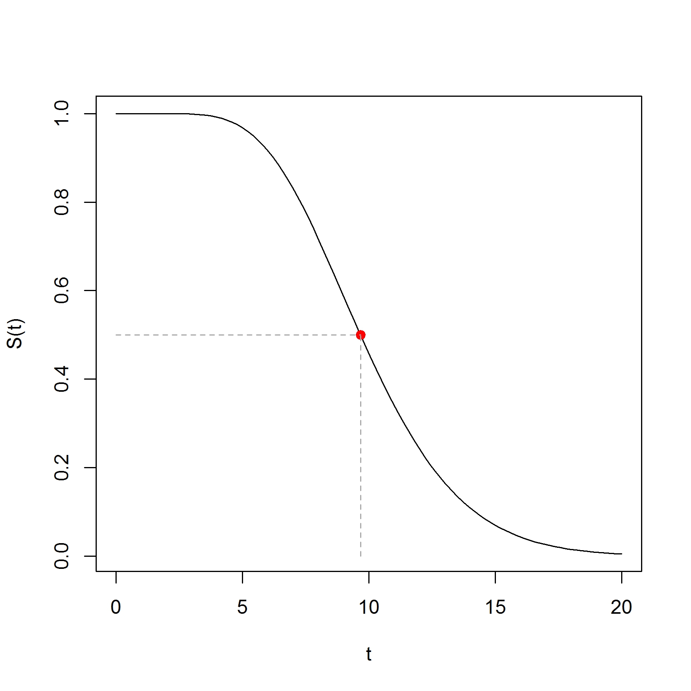
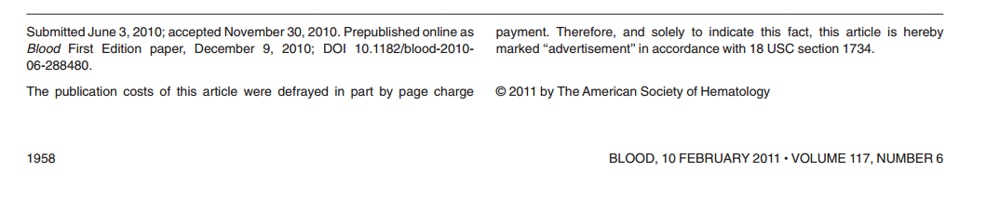

# Análise de Sobrevivência

## O que é análise de sobrevivência? {.build}

É uma coleção de métodos estatísticos utilizados para analisar dados em que a variável resposta de interesse consiste **no tempo até a ocorrência de um dado evento**.

O interesse pode estar em caracterizar o tempo até a ocorrência de um evento ou estudar **o risco de ocorrência de um evento por unidade de tempo**.

##  Algumas perguntas passíveis de resposta neste tipo de abordagem: {.build}

Qual o efeito de um determinado anticancerígeno sobre o tempo de sobrevivência?

Quais os fatores que podem estar associados ao tempo de duração da amamentação?

Quais os fatores preditivos para reinternação hospitalar, considerando o tempo entre internações?

Qual o efeito da unidade assistencial na sobrevivência após um infarto agudo do miocárdio?

## Introdução {.build}

**Tempo**: é o tempo em dias, semanas, anos, meses... do acompanhamento de um individuo a partir de um ponto inicial pré estabelecido até a ocorrência de um evento de interesse.

**Evento**: é alguma experiência de interesse que pode acontecer com os indivíduos em estudo. Tais como o diagnóstico de uma doença, recidiva de uma doença, a morte do paciente, retornar ao trabalho depois um procedimento cirúrgico e etc.

Em análise de sobrevivência é usual se referir ao tempo como **tempo de sobrevivência** e  ao evento como **falha**.

## Exemplo : Carciogênesis

Dados de tempo da inserção de carciogen DMBA até a mortalidade por cancer vaginal em ratos. Dois grupos foram obtidos de acordo com o regime do pré-tratamento.

**Grupo** | Tempo observado
----------|----------------
1  | 143, 164, 188, 188, 190, 192, 206, 209, 213, 216, 220, 227, 230, 234, 246, 265, 304, 216\*, 244\* 
2 | 142, 156, 163, 198, 205, 232, 232, 233, 233, 233, 233  239, 240, 261, 280, 280, 296, 296, 323, 204\*, 344\* 
Fonte: Kalbfleish and Prentice (2002) página 1

## Exemplo : Aleitamento materno { .small}

$T$ é o tempo entre o nascimento e desmame da criança

Criança | $T$ | Idade da mãe
--------|-----|-------
1 | 6 | 20
2 | 7 | 18
3 | 10| 27
4 | 2| 19
5 | 1 | 23
6 | 3 | 18
7 | 5 | 32
8 | 6 | 16
9 | 12 |  27
10 | 3 | 19

## Dados incompletos {.build}

Uma característica muito comum em dados de sobrevivência é a
presença de **observações incompletas** que podem ocorrer devido a
**censura** ou **trucamento**.

Ressalta-se o fato de que, mesmo incompletos, todos os resultados provenientes de um estudo de sobrevivência devem ser usados na análise estatística.

A **censura**, que é o caso mais típico, pode ser classificada como:
censura à direita, censura à esquerda e censura intervalar.

## Censura à direita {.build}

A situação mais frequente de observações incompletas em dados de
sobrevivência é a **censura à direita**. Ela consiste de situações em
que o tempo de ocorrência do evento não é observado, mas é sabido
ser maior que um dado tempo $t$ registrado.

A censura a direita pode ser classificada como

* **Censura do tipo I :** quando o estudo será terminado após um
período pré estabelecido de tempo;

* **Censura do tipo II :** quando o estudo será terminado após ter
ocorrido o evento de interesse em um número pré estabelecido
de indivíduos;

* **Censura aleatória :** uma observação é retirada do estudo sem
ter ocorrido a falha.

## Outros tipos de dados incompletos {.build}

>**Censura à esquerda:** ocorre quando o tempo registrado é maior do
que o tempo de falha, ou seja, o evento de interesse já aconteceu
quando o indivíduo foi observado.

>**Censura intervalar:** ocorre quando é conhecido somente que o
evento de interesse ocorreu em um certo intervalo de tempo.

>**Truncamento a esqueda** ou **entrada tardia:** é caracterizado por uma
condição que exclui certos indivíduos do estudo. Os indivíduos só
são considerados no estudo depois de observado um evento intermediário.

## Notação {.build}

* $T$ é a variável aleatória que representa o **tempo de sobrevivência** do indivíduo.

* $\delta$ é a **indicadora de falha**, isto é, recebe o valor 1 se o individuo falhou e 0 se cendurado.

A variável resposta em análise de sobrevivência é dada pelo par $(T,\delta)$

* $S(t)$ é chamada de **função de sobrevivência**.

* $\lambda(t)$ é chamada de **função de risco**.

## Função de Sobrevivência $S(t)$ {.build}

A função de sobrevivência $S(t)$ dá a probabilidade de um indivíduo sobreviver mais tempo que um dado tempo $t$.

Isto é, dá a probabilidade que a variável aleatória $T$ exceda um tempo $t$ específico.

$$S(t) = P(T > t)$$

è uma função não crescente, no tempo $t = 0$, $S(t) = S(0) = 1$ e no tempo $t = \infty$, $S(t) = S(\infty) = 1$. 

## Função de Sobrevivência $S(t)$ {.build}

O **tempo mediano de sobrevivência** é dado por $t_m$ tal que $S(t_m) = 0.5$. 

## Função de risco $\lambda(t)$

A função de risco é dada pela seguinte fórmula

$$\lambda(t) = \lim_{\Delta t \rightarrow t} \frac{P(t \leq T < \Delta t \,\vert\, T \geq t )}{\Delta t}$$

Representa a **taxa de falha ou velocidade instantânea da ocorrência dos eventos por unidade de tempo**

Note que, em contraste com a função de sobrevivência, que foca em *não falhar*, a função de risco foca na falha, isto é, na ocorr?ncia do evento de interesse.

A função de sobrevivência pode ser escrita como

$$S(t) = \exp \left[ - \int_0^t \lambda(u)du \right] $$

## Estimador de Kaplan-Meier {.build}

O estimador do **produto-limite** (PL) ou de **Kaplan-Meier** é um
estimador não paramétrico da função de sobrevivência.

A expressão geral do estimador de Kaplan-Meier pode obtida a partir da seguinte construção:

* Sejam $t_1 < t_2 < \dots < t_k$ , os $k$ tempos distintos e ordenados de falha observados;
* Defina $d_j$ como o número de falhas que ocorreram em $t_j$ , $j = 1, \dots, k$, e
* $n_j$ como o número de indivíduos sob risco em $t_j$ , ou seja, os
indivíduos que não falharam e não foram censurados até o
instante imediatamente anterior a $t_j$

## Estimador de Kaplan-Meier {.build}

Os valores estimados para a função de risco em cada tempo $t_j$ são dados por

$$ \hat{\lambda}(t_j) == \frac{d_j}{n_j}\,\,, j = 1,2,\dots,k$$

E os estimador de Kaplan-Meier para função de sobrevivência é então dado por

$$\hat{S}(t_j) = \left( \frac{n_1 - d_1}{n_1} \right) \left( \frac{n_2 - d_1}{n_2} \right) \dots \left( \frac{n_j - d_j}{n_j} \right) \,,\, j = 1,2,\dots,k$$

## Exemplo : Leucemia

Estudo de crianças com leucemia desenvolvido pelo Grupo Cooperativo para Tratamento de Leucemias Agudas em BH

Amostra de 103 crianças com idade inferior a 15 anos acompanhadas entre os anos de  1988 e 1992

tempo da remissão (ausência da doença) até a recidiva ou morte (o que ocorrer primeiro)

39 crianças são não censuradas

## Exemplo : Leucemia

## Exemplo : Carciogênesis

Estudo com ratos, tempo até a morte por cancer vaginal

##Comparando curvas de sobrevivência {.build}

O problema de comparação de distribuições de sobrevivências surge com
frequência em estudos de sobrevivência.

O objetivo é determinar se duas ou mais amostras surgem de uma mesma função de sobrevivência.

Por exemplo, pode ser de interesse comparar dois tratamentos em relação as curvas de sobrevivência até o tempo de morte por uma determinda doença. 

## Teste de *logrank*

Um teste muito utilizado é chamado de *logrank* proposto por Mantel
(1966) e se baseia em uma extensão do teste não-paramétrico de
Wilcoxon.

Esse teste não paramétrico é baseado na diferença entre as taxas de falha (ou funções de risco) associadas a cada curva de sobrevivência. 

O teste de *logrank* é particularmente adequado quando a razão das
funções de risco dos grupo é constante, isto é, tem a propriedade de
riscos proporcionais.

## Teste de *logrank*

O teste de *logrank* também é um teste do tipo qui-quadrado.

Ele compara as taxas de falha estimadas em cada grupo da amostra com as taxas de falhas esperadas sob a hipótese de que não há diferença entre os grupos.

A estatística do teste de *logrank* tem distribuição qui-quadrado com $p-1$ graus de liberdade, em que $p$ é o número de grupos (curvas) comparadas.

## Exemplo : Carciogênesis

 Grupo | N | Observedo | Esperado | (O-E)^2/E
-|--|-----------|----------|-----------
1 | 19 | 17 | 12.2  |   1.853 
2 | 21 | 19 | 23.8  |   0.954 

A estatística do teste é igual a 3,1 com 1 grau de liberdade.

O valor p é igual 0.077. Portanto, não há evidências para se rejeitar a hipótese nula.

## Exemplo: Estudo sobre câncer intestinal 

## Exemplo: Estudo sobre câncer intestinal {.build}

Estudo retrospectivo de coorte, entre 1993 e 2009, com 345 pacientes diagnosticados com *primary intestinal diffuse large B-cell lymphomas (DLBCL)*.

**Duas estratégias de tratamento** cirurgia+quimioterapia ou quimioterapia.

Os pacientes foram ainda agrupados de acordo com o estágio da doença segundo a escala Lugano : I/II e IV.

**Overall survival** : tempo do diagnóstico até a morte do paciente por qualquer causa.

**Progressive-free survival** : tempo a partir do diagnóstico até a data de progressão da doença, recidiva ou morte do paciente.

## Exemplo: Estudo sobre câncer intestinal 

## Exemplo: Estudo sobre câncer intestinal 

## Modelo de riscos proporcionais {.build}

O modelo de regressão mais amplamente utilizado para dados de sobrevivêncie é o **modelo de riscos proporcionais** de Cox.

Este modelo ajusta a função de risco $\lambda(t)$, considerando um risco basal $\lambda_0(t)$ e incluindo o vetor de covariáveis $x$, de forma que:

$$\lambda(t|x) = \lambda_0(t) \exp(x_1 \beta_1 + x_2 \beta_2 + \dots + x_p \beta_p) = \lambda_0(t)\exp(x^t \beta)$$

Ou seja, as covariáveis têm um efeito multiplicativo na função de risco. E os efeitos das covariáveis são constantes no tempo.

## Modelo de riscos proporcionais

A razão entre as funções de riscos de ocorrência do evento de dois indivíduos $i$ e $j$, com covariáveis $x_i = (x_{i1}, x_{i2}, \dots , x_{ip})$ e $x_j = (x_{j1}, x_{j2}, \dots , x_{jp})$ é:

$$\
\frac{\lambda_i(t \vert x_i)} {\lambda_j(t \vert x_j)} =
\frac{\exp(x_i^t \beta)}{\exp(x_j^t \beta)}
$$

Observe que esta razão de riscos **não varia ao longo do tempo**, o que implica no 
**Modelo de Riscos Porporcionais**

## Modelo de riscos proporcionais

Suponha que a variável $x$ assuma os valores 1 se o indivíduo for do sexo masculino e 0 se feminino.

Se o indíviduo $i$ for do sexo masculino e o $j$ do sexo feminino, o risco relativo entre eles é dado por

$$\frac{\lambda_i(t \vert x_i)} {\lambda_j(t \vert x_j)} = \exp(\beta)$$

e, portanto, $\exp(\beta)$ representa o quão é o risco de falhar de indivíduos do sexo masculino comparados aos do sexo feminino.

## Modelo de Cox

Partindo do pressuposto de proporcionalidade, é possível estimar os efeitos das
covariáveis sem qualquer suposição a respeito da distribução do tempo de
sobrevivência.

Por isso o modelo de Cox é dito **semi-paramétrico.**

Não se assume qualquer distribuição estatística para a função de risco
basal, $\lambda_0(t)$. 

A principal suposição feita é que as covariáveis agem **multiplicativamente** sobre o risco e esta é a parte paramétrica do modelo.

## Pressupostos do modelo de Cox

* As covariáveis agem multiplicativamente sobre a função de risco (parte
paramétrica do modelo.)

* A razão de riscos é constante ao longo de tempo (**riscos
proporcionais**.)

* Os tempos de ocorrência do evento são independentes.

* A função de risco basal é uma função contínua e bem comportada

## Exemplo : Carciogênesis

Estimativa dos parãmetros estimados para o modelo de riscos proporcionais

Covariável | $\hat{\beta}$ | $\exp(\hat{\beta})$ | valor p
-----------|---------------|---------------------|-------
grupo      | 0.5686  |  1.766 |   0.101

## Exemplo: Estudo sobre cancer intestinal 

# Outros problemas em análise de sobrevivência

## Eventos múltiplos ou recorrentes {.build}

Em muitos cenários de pesquisa um indivíduo pode experimentar um dado evento de interesse muitas vezes. 

**Exemplos**

* Episódios multiplos de recaídas da remissão em pacientes com leucemia.

* Recorrentes ataques cardíacos em pacientes em tratamento para doenças do coração.

## Riscos competitivos  {.build}

Riscos competitivos ocorrem quando hé pelo menos duas formas de um indivíduo falhar, mas o indíviduo só pode falhar de uma delas. 

**Exemplos**

* Uma pessoa pode morrer de cancer de pulmão ou de acidente vascular cerebral

* Soldados em uma guerra podem morrer em combate ou por uma acidente

* A causa de egresso de um aluno pode ser conclusão do curso ou evasão

**Mesmo que se tenha interesse em estudar apenas das causas de falha, as demais não podem ser tratadas como censura.**

##

Slides produzidos pelos professores:

* Samara Kiihl

* Tatiana Benaglia

* Benilton Carvalho

* Rafael Maia
