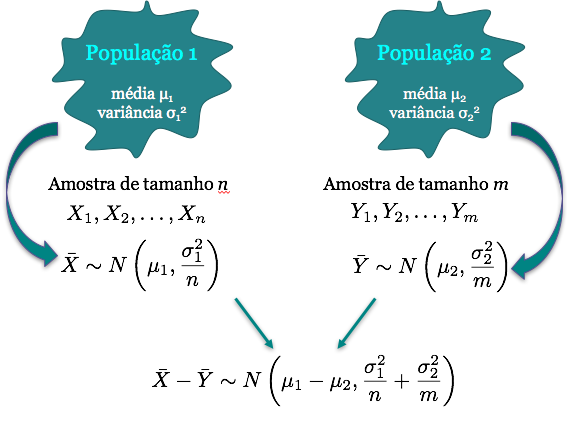

# Inferência Estatística

## Inferência Estatística - Conceitos Básicos

Alguns conceitos básicos que foram vistos ontem:

**População**: todos os elementos ou resultados de um problema que está sendo estudado.

**Amostra:** qualquer subconjunto da população que contém os elementos que podem ser observados e é onde as quantidades de interesse podem ser medidas.

**Parâmetros**: Característica numérica (desconhecida) da distribuição dos elementos da população.

**Estimador/Estatística**: Função da amostra, construída com a finalidade de representar, ou estimar um parâmetro de interesse na população. 

**Estimativa**: Valor numérico que um estimador assume para uma dada amostra.


## Inferência Estatística 

<center></center>

**Intervalo de Confiança**: Fornece um conjunto de valores plausíveis para um parâmetro populacional ou uma função de parâmetros populacionais.


**Teste de Hipóteses**: Regra de decisão que permite avaliar se os dados obtidos em uma amostra suportam uma hipótese de status quo a respeito do parâmetro de interesse. 


## Inferência para duas populações {.build}

Hoje vamos focar em inferência para duas ou mais populações.

**Exemplos:** 

1) Diferença no IMC para pessoas hipertensas e não-hipertensas.

2) Contagem de hemáceas para um grupo de pacientes e um grupo controle.

3) Pressão arterial de pessoas sedentárias versus pessoas fisicamente ativas.

4) Proporção de pacientes que melhoraram para dois tratamentos diferentes.


# Inferência para duas populações: intervalo de confiança para duas médias

## Intervalo de confiança para duas médias {.build}

De maneira geral, suponha que queremos estimar o parâmetro populacional $\theta$ através de um intervalo.

Um intervalo de confiança (IC) para $\theta$ é sempre da forma:

$$ \mbox{estimativa} \pm \mbox{margem de erro}$$

$$\hat{\theta} \pm \mbox{margem de erro}$$

Sendo:

* $\hat \theta$ uma estimativa pontual de $\theta$

* **margem de erro:** quantidade que depende da distribuição amostral do estimador pontual de $\theta$, do grau de confiança pré-estabelecido e do erro padrão da estimativa


## Intervalo de confiança para duas médias {.build .smaller}

**População 1:** Coletamos uma amostra aleatória $X_1, X_2, \ldots,X_n$ de uma população com média $\mu_1$ e a variância $\sigma_1^2$ e usamos $\bar{X}$ para estimar $\mu_1$.

**População 2:** Coletamos uma amostra aleatória $Y_1, Y_2, \ldots,Y_m$ de uma população com média $\mu_2$ e a variância $\sigma_2^2$ e usamos $\bar{Y}$ para estimar $\mu_2$.

A população 1 é independente da população 2.

**Condições:** 

(a) As populações 1 e 2 são aproximadamente normais ou 

(b) Os tamanhos amostrais $n$ e $m$ são suficientemente grandes.

Se pelo menos uma das condições acima é satisfeita, temos pelo TLC:
$$\bar{X} \sim N\left(\mu_1,\frac{\sigma_1^2}{n} \right) \quad \mbox{e} \quad  \bar{Y} \sim N\left(\mu_2,\frac{\sigma_2^2}{m} \right)$$


## Intervalo de confiança para duas médias

<center></center>


## Intervalo de confiança para duas médias {.build}
**Caso 1: Variâncias diferentes e conhecidas**

Assumindo que as duas amostras $X_1, \ldots, X_n$ e $Y_1, \ldots, Y_m$ são independentes com $\sigma_1^2 \neq \sigma_2^2$ conhecidas, temos:

$$ \bar{X} - \bar{Y} \sim N\left(\mu_1 - \mu_2, \frac{\sigma_1^{2}}{n} + \frac{\sigma_2^{2}}{m}  \right)$$

Um IC de $100(1-\alpha)\%$ para $\mu_1 - \mu_2$ é dado por:
$$IC(\mu_1 - \mu_2, 1-\alpha) = (\bar{X} - \bar{Y}) \pm z_{\alpha/2} \sqrt{\frac{\sigma_1^{2}}{n} + \frac{\sigma_2^{2}}{m}}$$


## Relembrando: Como encontrar $z_{\alpha/2}$

$$P(|Z|\leq z_{\alpha/2})=P(-z_{\alpha/2}\leq Z \leq z_{\alpha/2})=1-\alpha$$

<center>
```{r, echo=FALSE, results='hide', fig.height=3.5, fig.width=5, message=FALSE}
library(openintro)
par(mar=c(2, 4, 1, 1) + 0.1)
normTail(U = 2,L=-2,
         col = COL[1],
         xlim = c(-3, 3),
         axes  =  FALSE,
         lwd  =  2)
at <- c(-2, 0,2)
labels <- expression(-z[alpha/2], 0,z[alpha/2])
axis(1, at, labels, cex.axis = 1)
yMax <- 0.4

text(0, yMax * 0.4, labels= expression('área '* 1-alpha), cex = 1.2)
arrows(2.5, yMax / 2,
       2.5, yMax / 10,
       length = 0.1,
       col = COL[1],
       lwd = 1.5)
text(2.5, yMax / 2, labels= expression('área '* alpha/2),
     pos = 3,
     cex = 1.2,
     col = COL[1])


arrows(-2.5, yMax / 2,
       -2.5, yMax / 10,
       length = 0.1,
       col = COL[1],
       lwd = 1.5)
text(-2.5, yMax / 2, labels= expression('área '* alpha/2),
     pos = 3,
     cex = 1.2,
     col = COL[1])
```
</center>

Procure na tabela o valor de $z$ tal que a probabilidade acumulada até o valor de $z$, isto é $P(Z\leq z)=\Phi(z)$, seja $1-\alpha/2$.


## Intervalo de confiança para duas médias {.build}
**Caso 2: Variâncias iguais e conhecidas**

Considere o caso em que as variâncias são conhecidas e idênticas, isto é, $\sigma_1^2 = \sigma_2^2 = \sigma^2$.

Então,
$$ \bar{X} - \bar{Y} \sim N\left(\mu_1 - \mu_2, \sigma^2 \left(\frac{1}{n} + \frac{1}{m}\right)  \right)$$

Um IC de $100(1-\alpha)\%$ para $\mu_1 - \mu_2$ é dado por:
$$IC(\mu_1 - \mu_2, 1-\alpha) = (\bar{X} - \bar{Y}) \pm z_{\alpha/2} \sqrt{\sigma^2 \left(\frac{1}{n} + \frac{1}{m} \right)}$$

## Intervalo de Confiança para duas médias {.build}
**Caso 3: Variâncias iguais e desconhecidas**

E se as variâncias das duas populações são idênticas porém desconhecidas, isto é, $\sigma_1^2 = \sigma_2^2 = \sigma^2$, $\sigma^2$ desconhecida?

Assim como no caso de uma média com variância desconhecida, usamos uma estimativa de $\sigma^2$ e a distribuição normal é substituída pela distribuição $t$.

No caso de duas populações, o estimador da variância $\sigma^2$ é a combinação das variâncias amostrais de cada população, ou seja,
$$S_p^2 = \frac{(n-1)S_1^2 + (m-1)S_2^2}{n+m-2},$$
sendo $S_i^2$ é a variância amostral da população $i$.


## Intervalo de confiança para duas médias {.build}
Então temos:$\displaystyle \quad T= \frac{(\bar{X} - \bar{Y}) - (\mu_1 - \mu_2)}{\displaystyle \sqrt{S_p^2 \left(\frac{1}{n} + \frac{1}{m}\right) }} \sim t_{n+m-2}$

E um IC de $100(1-\alpha)\%$ para $\mu_1 - \mu_2$ é dado por:
$$IC(\mu_1 - \mu_2, 1-\alpha) = (\bar{X} - \bar{Y}) \pm t_{n+m-2, \alpha/2} \sqrt{S_p^2 \left(\frac{1}{n} + \frac{1}{m} \right)}$$

**Observação:** Se $n$ e $m$ são pequenos, as duas amostras devem vir de populações aproximadamente normais. Se $n$ e $m$ são grandes, então a distribuição $t$ com $n+m-2$ graus de liberdade aproxima-se de uma normal.


## Relembrando: Como encontrar $t_{\nu,\alpha/2}$

$$P(-t_{\nu,\alpha/2} < T < t_{\nu,\alpha/2}) = 1-\alpha$$

<center>
```{r, echo=FALSE, results='hide', fig.height=4, fig.width=6}
par(mar=c(2, 4, 1, 1) + 0.1)
normTail(U = 2,L=-2,
         col = COL[1],
         xlim = c(-3, 3),
         axes  =  FALSE,
         lwd  =  2)
at <- c(-2, 0,2)
labels <- expression(-t[alpha/2], 0,t[alpha/2])
axis(1, at, labels, cex.axis = 1)
yMax <- 0.4

text(0, yMax * 0.4, labels= expression('área '* 1-alpha), cex = 1.2)
arrows(2.5, yMax / 2,
       2.5, yMax / 10,
       length = 0.1,
       col = COL[1],
       lwd = 1.5)
text(2.5, yMax / 2, labels= expression('área '* alpha/2),
     pos = 3,
     cex = 1.2,
     col = COL[1])


arrows(-2.5, yMax / 2,
       -2.5, yMax / 10,
       length = 0.1,
       col = COL[1],
       lwd = 1.5)
text(-2.5, yMax / 2, labels= expression('área '* alpha/2),
     pos = 3,
     cex = 1.2,
     col = COL[1])
```
</center>

Nesse caso, $\nu=n+m-2$ e os valores da distribuição $t$ encontram-se tabelados.


## Intervalo de Confiança para duas médias {.build}
**Caso 4: Variâncias diferentes e desconhecidas**

Como aqui as variâncias são diferentes e desconhecidas, $\sigma_1^2 \neq \sigma_2^2$, usamos como estimativas as variâncias amostrais de cada população.

E um IC de $100(1-\alpha)\%$ para $\mu_1 - \mu_2$ é dado por:
$$IC(\mu_1 - \mu_2, 1-\alpha) = (\bar{X} - \bar{Y}) \pm t_{\nu, \alpha/2} \sqrt{ \frac{S_1^2}{n} + \frac{S_2^2}{m}},$$
onde $\nu$ são os graus de liberdade da distribuição $t$ obtido por uma aproximação.


## Intervalo de confiança para duas médias

**Resumindo**

Variâncias             | $IC(\mu_1 - \mu_2, 1-\alpha)$
---------------------- | -----------------------------
Diferentes e conhecidas ($\sigma_1^2 \neq \sigma_2^2$) | $(\bar{X} - \bar{Y}) \pm z_{\alpha/2} \sqrt{\displaystyle \frac{\sigma_1^{2}}{n} + \frac{\sigma_2^{2}}{m}}$
Iguais e conhecidas ($\sigma_1^2 = \sigma_2^2 =\sigma^2$) | $(\bar{X} - \bar{Y}) \pm z_{\alpha/2} \sqrt{\displaystyle \sigma^2 \left(\frac{1}{n} + \frac{1}{m} \right)}$
Iguais e desconhecidas ($\sigma_1^2 = \sigma_2^2 =\sigma^2$) | $(\bar{X} - \bar{Y}) \pm t_{n+m-2, \alpha/2} \sqrt{\displaystyle S_p^2 \left(\frac{1}{n} + \frac{1}{m} \right)}$
Diferente e desconhecidas ($\sigma_1^2 \neq \sigma_2^2$) | $(\bar{X} - \bar{Y}) \pm t_{\nu, \alpha/2} \sqrt{\displaystyle \frac{S_1^2}{n} + \frac{S_2^2}{m}}$


## Exemplo: tempo de incubação de dois vírus {.build}
```{r, echo=FALSE}
x <- c(4.56, 3.72, 3.45, 2.86, 4.03,
       4.08, 6.56, 4.31, 0.42, 5.56,
       5.92, 2.65, 4.54, 4.04, 4.23,
       6.24, 6.16, 5.46, 3.22, 2.28)

y <- c(2.44, 1.49, 2.68, 2.60, 1.51,
       1.60, 1.47, 3.70, 2.22, 1.78,
       2.36, 1.56, 2.98, 3.33, 2.22,
       0.58, 2.26, 2.26, 1.92, 0.50,
       1.17, 1.70)

xbar <- round(mean(x), 2)
ybar <- round(mean(y), 2)
sigma21 <- 2.25
sigma22 <- 1
n <- length(x)
m <- length(y)

## Intervalo de Confiança
alpha <- .05 
z.alfa2 <- round(qnorm(1-alpha/2), 2)

est <- xbar-ybar

## Assumindo variâncias diferentes e conhecidas
se.est1 <- sqrt(sigma21/n + sigma22/m)
ic1 <- round(est + c(-1, 1)*z.alfa2*se.est1, 2)

## Assumindo variâncias iguais e desconhecidas
s21 <- round(var(x), 2)
s22 <- round(var(y), 2)

t.alfa2 <- round(qt(1-alpha/2, n+m-2), 2)
s2p <- round(((n-1)*s21 + (m-1)*s22)/(n+m-2), 2)
se.est2 <- sqrt(s2p*(1/n + 1/m))
ic2 <- round(est + c(-1, 1)*t.alfa2*se.est2, 2)
```

O tempo de incubação do vírus 1 segue uma distribuição normal com média $\mu_1$ e desvio padrão $\sigma_{1}=`r sqrt(sigma21)`$. Por outro lado, o tempo de incubação do vírus 2 segue uma distribuição normal com média $\mu_2$ e desvio padrão $\sigma_{2}=`r sqrt(sigma22)`$. Os tempos de incubação de ambos os vírus são considerados independentes. 

Realizaram um estudo de controle e os tempos de incubação registrados foram (tempo em meses):

* X: tempo de incubação do vírus 1 (`r n` observações)
```{r, echo=FALSE}
x
```

* Y: tempo de incubação do vírus 2 (`r m` observações)
```{r, echo=FALSE}
y
```


## Exemplo: tempo de incubação de dois vírus {.build}

Suspeita-se que o tempo de incubação do vírus 1 é maior que o do vírus 2.

Construa um IC de $95\%$ para a diferença do tempo médio de incubação entre os vírus, isto é, $\mu_1 - \mu_2$.

Antes de tudo temos que calcular a média amostral das duas populações:
$\bar x=`r xbar`$ e $\bar y = `r ybar`$. 

Pelo enunciado, as duas populações são normais e as variâncias são conhecidas:
$\sigma_1^2 = `r sigma21`$ e $\sigma_2^2= `r sigma22`$.

Veja que as populações são normais, variâncias diferentes mas conhecidas. Além disso, $n=`r n`$ e $m=`r m`$.


## Exemplo: tempo de incubação de dois vírus {.build}

Portanto, um Intervalo de $95\%$ de confiança para $\mu_1-\mu_2$ é dado por:
$$\begin{aligned}
IC(\mu_1-\mu_2, 0.95)&= (\bar{X} - \bar{Y}) \pm z_{0.025} \sqrt{\frac{\sigma_1^{2}}{n} + \frac{\sigma_2^{2}}{m}} \\
&= (`r xbar` - `r ybar`) \pm `r z.alfa2` \sqrt{\frac{`r sigma21`}{`r n`} + \frac{`r sigma22`}{`r m`}} \\
&= `r est` \pm `r  round(z.alfa2*se.est1, 2)` = [`r ic1[1]`, `r ic1[2]`]
\end{aligned}$$

**Interpretação:** Com grau de confiança de `r (1-alpha)*100`\%, estimamos que a diferença entre o tempo médio de incubação do vírus 1 para o vírus 2 está entre `r ic1[1]` e `r ic1[2]` meses. 

Baseados nesse IC, o que podemos dizer a respeito da suspeita de que o tempo de incubação do vírus 1 é maior que o do vírus 2?

Portanto, com um grau de confiança de `r (1-alpha)*100`\%, estimamos que a diferença entre os pesos médios dos tecidos do tipo A e tipo B está entre `r ic1[1]` e `r ic1[2]` mg. 


## Exemplo: tempo de incubação {.build}

Vamos assumir agora que as variâncias populacionais não fossem conhecidas, porém pode-se assumir que são iguais. 

Primeiramente precisamos calcular as variâncias amostrais, ou seja, 
$$S_1^2=`r s21` \qquad \mbox{e} \qquad S_2^2=`r s22`$$ 

Vamos então estimar a variância amostral combinada:
$$\begin{aligned}
S_p^2 &= \frac{(n-1)S_1^2 + (m-1)S_2^2}{n+m-2}\\
&= \frac{(`r n`-1) (`r s21`) + (`r m`-1)(`r s22`)}{`r n` + `r m` - 2} \\
&= `r s2p`
\end{aligned}$$


## Exemplo: tempo de incubação {.build}
Nesse caso, um IC de 95% para $\mu_1 - \mu_2$ é dado por:
$$\begin{aligned}
IC(\mu_1 - \mu_2, 0.95) &= (\bar{X} - \bar{Y}) \pm t_{n+m-2, 0.025} \sqrt{S_p^2 \left(\frac{1}{n} + \frac{1}{m} \right)} \\
&= (`r xbar` - `r ybar`) \pm `r t.alfa2` \sqrt{`r s2p` \left(\frac{1}{`r n`} + \frac{1}{`r m`}\right)} \\
&= `r est` \pm `r round(t.alfa2*se.est2, 2)` \\
&= [`r ic2[1]`, `r ic2[2]`]
\end{aligned}
$$

Portanto, com um grau de confiança de `r (1-alpha)*100`\%, estimamos que a diferença entre o tempo médio de incubação do vírus 1 para o vírus 2 está entre `r ic2[1]` e `r ic2[2]` mg. 


## Intervalo de Confiança para duas proporções {.build}
Considere $X_1, \ldots,X_{n_1}$ e $Y_1, \ldots,Y_{n_2}$ duas amostras independentes de ensaios de Bernoulli tal que $X \sim b(p_1)$ e $Y \sim b(p_2)$, com probabilidade $p_1$ e $p_2$ de apresentarem uma certa característica.

Queremos encontrar um IC de confiança para a diferença entre as proporções $p_1$ e $p_2$, ou seja, um IC para $p_1 – p_2$. 

Em aulas anteriores vimos que:
$$\hat p_1 \sim N\left(p_1,\frac{p_1(1-p_1)}{n_1} \right) \quad \mbox{e} \quad  \hat p_2 \sim N\left(p_2,\frac{p_2(1-p_2)}{n_2} \right)$$

Como as variâncias de $\hat p_1$ e $\hat p_2$ dependem de $p_1$ e $p_2$ e, portanto, não são conhecidas, iremos usar uma estimativa dessas variâncias.


## Intervalo de Confiança para duas proporções {.build}
Ou seja,
$$\hat p_1 \sim N\left(p_1,\frac{\hat p_1(1 - \hat p_1)}{n_1} \right) \quad \mbox{e} \quad  \hat p_2 \sim N\left(p_2,\frac{\hat p_2(1 - \hat p_2)}{n_2} \right)$$

**Condições:** Todas as quantidades $n_1\hat p_1, \; n_1(1- \hat p_1), \; n_2\hat p_2 \; \mbox{ e } \; n_2(1- \hat p_2)$ devem ser pelo menos igual a 10 para que a aproximação pela normal seja válida.

Então,
$$Z = \frac{(\hat p_1 - \hat p_2) - (p_1 - p_2)}{\sqrt{\displaystyle \frac{\hat p_1(1 - \hat p_1)}{n_1} + \frac{\hat p_2(1 - \hat p_2)}{n_2}}} \sim N(0, 1)$$


## Intervalo de Confiança para duas proporções {.build}
Similar com o que fizemos para uma proporção, podemos então construir um IC de $100(1-\alpha)\%$ para $p_1 - p_2$ da seguinte forma:

$$P(-z_{\alpha/2} \leq Z \leq z_{\alpha/2}) = P \left( -z_{\alpha/2} \leq \frac{(\hat p_1 - \hat p_2) - (p_1 - p_2)}{\sqrt{\frac{\hat p_1(1 - \hat p_1)}{n_1} + \frac{\hat p_2 (1 - \hat p_2)}{n_2}}} \leq z_{\alpha/2}\right) = 1-\alpha$$

Então, um IC de $100(1-\alpha)\%$ para $p_1 - p_2$ é dado por:
$$IC(p_1 - p_2, 1-\alpha) = (\hat p_1 - \hat p_2) \pm z_{\alpha/2} \sqrt{\frac{\hat p_1 (1 - \hat p_1)}{n_1} + \frac{\hat p_2 (1 - \hat p_2)}{n_2}}$$


## Exemplo: Ensaio Clínico {.build}
Um ensaio clínico é realizado para avaliar um novo tipo de tratamento contra uma doença e comparar os resultados com aqueles obtidos usando o tratamento tradicional. 

Dos 50 pacientes tratados com o tratamento novo, 36 se curaram e dos 45 tratados com o antigo 29 se curaram. 

Seja $p_1$ a proporção de curados com o tratamento novo e $p_2$ a proporção de curados com o tratamento antigo na população.

Encontre um IC de 99% para $p_1 - p_2$.

## Exemplo: Ensaio Clínico {.build}
```{r, echo=FALSE}
x1 <- 36
n1 <- 50
p1 <- round(x1/n1, 2)

x2 <- 29
n2 <- 45
p2 <- round(x2/n2, 2)

alpha <- .01
z.alfa2 <- round(qnorm(1-alpha/2), 2)

est <- p1-p2
se.est <- sqrt(p1*(1-p1)/n1 + p2*(1-p2)/n2)
ic <- round(est + c(-1, 1)*z.alfa2*se.est, 3)
```

A proporção de curados pelos tratamentos novo e antigo na amostra são:
$$\hat{p}_1 = \frac{36}{50}=`r p1` \quad \mbox{e} \quad \hat p_2 = \frac{29}{45}=`r p2` $$

Então um IC de 99% para $p_1 - p_2$ é dado por:
$$\begin{aligned}
IC(p_1 - p_2, `r 1-alpha`) &= (`r p1` - `r p2`) \pm z_{0.005} \sqrt{\frac{`r p1` (`r 1-p1`)}{`r n1`} + \frac{`r p2` (`r 1-p2`)}{`r n2`}} \\
&= `r est` \pm `r z.alfa2` \times `r round(se.est, 3)` \\
& = `r est` \pm `r  round(z.alfa2*se.est, 3)` = [`r ic[1]`, `r ic[2]`]
\end{aligned}
$$

Portanto, com grau de confiança de `r (1-alpha)*100`\%, estimamos que a diferença entre as  proporções de curados pelos tratamentos novo e antigo está entre `r ic[1]` e `r ic[2]`. 


## Leituras

* [Ross](http://www.sciencedirect.com/science/article/pii/B9780123743886000107): capítulo 10. 
* [OpenIntro](https://www.openintro.org/stat/textbook.php): seção 5.3.1. e 6.2.2
* Magalhães: capítulo 9.

##

Slides produzidos pelos professores:

* Samara Kiihl

* Tatiana Benaglia

* Benilton Carvalho

* Rafael Maia
