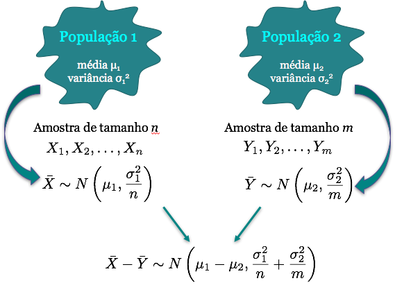

# Inferência para duas populações: Teste de hipótese para duas médias

## Teste de hipótese para duas médias {.build .smaller}

**População 1:** Coletamos uma amostra aleatória $X_1, X_2, \ldots,X_n$ de uma população com média $\mu_1$ e a variância $\sigma_1^2$ e usamos $\bar{X}$ para estimar $\mu_1$.

**População 2:** Coletamos uma amostra aleatória $Y_1, Y_2, \ldots,Y_m$ de uma população com média $\mu_2$ e a variância $\sigma_2^2$ e usamos $\bar{Y}$ para estimar $\mu_2$.

A população 1 é independente da população 2.

**Condições:** 

(a) As populações 1 e 2 são aproximadamente normais ou 

(b) Os tamanhos amostrais $n$ e $m$ são suficientemente grandes.

Se pelo menos uma das condições acima é satisfeita, temos pelo TLC:
$$\bar{X} \sim N\left(\mu_1,\frac{\sigma_1^2}{n} \right) \quad \mbox{e} \quad  \bar{Y} \sim N\left(\mu_2,\frac{\sigma_2^2}{m} \right)$$


## Teste de hipótese para duas médias

<center></center>


## Passos de um teste de hipótese {.build}

**Passo 1:** Suposições

**Passo 2:** Hipóteses

**Passo 3:** Estatística do teste

**Passo 4:** Valor-de-p

**Passo 5:** Conclusão


## Teste de hipótese para duas médias {.build}
**Caso 1: Variâncias diferentes e conhecidas**

Assumindo que as duas amostras $X_1, \ldots, X_n$ e $Y_1, \ldots, Y_m$ são independentes com $\sigma_1^2 \neq \sigma_2^2$ conhecidas, temos:

$$ \bar{X} - \bar{Y} \sim N\left(\mu_1 - \mu_2, \frac{\sigma_1^{2}}{n} + \frac{\sigma_2^{2}}{m}  \right)$$


## Teste de hipótese para duas médias  {.build}
**Caso 1: Variâncias diferentes e conhecidas**

**Hipóteses**: 
$$H_0: \mu_1-\mu_2=\Delta_0 \quad \mbox{vs} \quad H_1: \begin{cases}
\mu_1-\mu_2\neq\Delta_0 & \mbox{(bilateral)}\\
\mu_1-\mu_2 > \Delta_0 & \mbox{(unilateral à direita)} \\
\mu_1-\mu_2 < \Delta_0 & \mbox{(unilateral à esquerda)}
\end{cases}
$$

**Estatística do teste:** Sob a hipótese $H_0$, temos
$$Z= \frac{(\bar{X} - \bar{Y}) - \overbrace{(\mu_1 - \mu_2)}^{\Delta_0}}{\displaystyle  \sqrt{\frac{\sigma_1^{2}}{n} + \frac{\sigma_2^{2}}{m}}} \stackrel{H_0}{\sim} N(0, 1)$$


## Teste de hipótese para duas médias {.build}

> **População 1:** uma amostra aleatória de tamanho $n$ é coletada da população $X$ e encontra-se uma estimativa de $\mu_1$, a média amostral $\bar{X}$. 

> **População 2:** uma amostra aleatória de tamanho $m$ é coletada da população $Y$ e encontra-se uma estimativa de $\mu_2$, a média amostral $\bar{Y}$. 

Calcula-se a estatística do teste usando os dados das amostras:
$$z_{obs}= \frac{(\bar X - \bar Y) - \Delta_0}{\displaystyle \sqrt{\frac{\sigma_1^{2}}{n} + \frac{\sigma_2^{2}}{m}}}$$

## Teste de hipótese para duas médias {.build}
**Valor-de-p:** Depende de $H_1$
$$
    \begin{aligned}
    \mbox{Hipótese Alternativa} & \qquad \qquad  \mbox{Valor-de-p} \\
    H_1: \mu_1 - \mu_2 \neq \Delta_0 & \qquad \qquad P(|Z| \geq |z_{obs}|) \\
    H_1: \mu_1 - \mu_2 > \Delta_0 & \qquad \qquad P(Z \geq z_{obs}) \\
    H_1: \mu_1 - \mu_2 < \Delta_0 & \qquad \qquad P(Z \leq z_{obs})
    \end{aligned}
$$

**Decisão:** Para um nível de significância $\alpha=0.05$:

* Rejeita-se $H_0$ se valor-de-p $< \alpha$.

* Não Rejeita-se $H_0$ se valor-de-p $\geq \alpha$.


## Teste de hipótese para duas médias {.build}
**Caso 2: Variâncias iguais e conhecidas**

$$ \bar{X} - \bar{Y} \sim N\left(\mu_1 - \mu_2, \sigma^{2} \left( \frac{1}{n} + \frac{1}{m} \right) \right)$$

**Hipóteses:** As mesmas definidas anteriormente.

**Estatística do teste:** Sob a hipótese $H_0$, temos
$$Z= \frac{(\bar{X} - \bar{Y}) - \overbrace{(\mu_1 - \mu_2)}^{\Delta_0}}{\displaystyle  \sqrt{\sigma^2 \left(\frac{1}{n} + \frac{1}{m}\right)}} \stackrel{H_0}{\sim} N(0, 1)$$
**Valor-de-p**: calculado de forma análoga ao que fizemos anteriormente.


## Teste de hipótese para duas médias {.build}
**Caso 3: Variâncias iguais e desconhecidas**

Assim como no caso de uma média com variância desconhecida, usamos uma estimativa de $\sigma^2$ e a distribuição normal é substituída pela distribuição $t$.

No caso de duas populações, o estimador da variância $\sigma^2$ é a combinação das variâncias amostrais de cada população, ou seja,
$$S_p^2 = \frac{(n-1)S_1^2 + (m-1)S_2^2}{n+m-2},$$
sendo $S_i^2$ é a variância amostral da população $i$.


## Teste de hipótese para duas médias {.build}

Quando $\sigma^2$ é conhecida:

$$ \frac{\bar{X} - \bar{Y}-(\mu_1-\mu_2)}{\displaystyle \sqrt{\sigma^2 \left(\frac{1}{n} + \frac{1}{m}\right)}} \sim N(0,1)$$

Quando $\sigma^2$ é desconhecida:
$$ \frac{\bar{X} - \bar{Y}-(\mu_1-\mu_2)}{\displaystyle \sqrt{S_p^2 \left(\frac{1}{n} + \frac{1}{m}\right)}} \sim t_{n+m-2}$$


## Teste de hipótese para duas médias {.build}

**Hipóteses:** As mesmas definidas anteriormente

**Estatística do teste:** Sob a hipótese $H_0$, temos
$$T= \frac{(\bar{X} - \bar{Y}) - \overbrace{(\mu_1 - \mu_2)}^{\Delta_0}}{\displaystyle  \sqrt{S_p^2 \left(\frac{1}{n} + \frac{1}{m}\right)}} \stackrel{H_0}{\sim} t_{n+m-2}$$

**Observação:** Se $n$ e $m$ são pequenos, as duas amostras devem vir de populações aproximadamente normais. Se $n$ e $m$ são grandes, então a distribuição $t$ com $n+m-2$ graus de liberdade aproxima-se de uma normal.

Esse teste é conhecido como **teste t para amostras independentes**.


## Teste de hipótese para duas médias {.build}
**Caso 4: Variâncias diferentes e desconhecidas**

Como as variâncias são diferentes e desconhecidas, $\sigma_1^2 \neq \sigma_2^2$, usamos como estimativas as variâncias amostrais de cada população. Assim:

$$ \frac{\bar{X} - \bar{Y}-(\mu_1-\mu_2)}{\displaystyle \sqrt{\frac{S_1^2}{n} + \frac{S_2^2}{m}}} \sim t_{\nu},$$
onde $\nu$ é calculado por uma aproximação.


## Teste de hipótese para duas médias {.build}

**Hipóteses:** As mesmas definidas anteriormente

**Estatística do teste:** Sob a hipótese $H_0$, temos
$$T= \frac{(\bar{X} - \bar{Y}) - \overbrace{(\mu_1 - \mu_2)}^{\Delta_0}}{\displaystyle  \sqrt{\frac{S_1^2}{n} + \frac{S_2^2}{m}}} \stackrel{H_0}{\sim} t_{\nu}$$

Esse teste é conhecido como **teste t para amostras independentes modificado**.


## Resumo: Teste de hipótese para duas médias {.smaller}

**Hipóteses**: 
$$H_0: \mu_1-\mu_2=\Delta_0 \quad \mbox{vs} \quad H_1: \begin{cases}
\mu_1-\mu_2\neq\Delta_0 & \mbox{(bilateral)}\\
\mu_1-\mu_2 > \Delta_0 & \mbox{(unilateral à direita)} \\
\mu_1-\mu_2 < \Delta_0 & \mbox{(unilateral à esquerda)}
\end{cases}
$$


**Estatísticas do teste** para cada caso:

Variâncias                 | Conhecida | Desconhecida 
-------------------------- | --------- | ------------
Diferentes  ($\sigma_1^2 \neq \sigma_2^2$) | $$Z= \frac{(\bar{X} - \bar{Y}) - \Delta_0}{ \sqrt{\frac{\sigma_1^{2}}{n} + \frac{\sigma_2^{2}}{m}}} \sim N(0, 1)$$ | $$T\sim\frac{(\bar{X} - \bar{Y}) -\Delta_0}{ \sqrt{\frac{S_1^2}{n} + \frac{S_2^2}{m}}}\sim t_{\nu}$$
Iguais ($\sigma_1^2 = \sigma_2^2 =\sigma^2$) | $$Z= \frac{(\bar{X} - \bar{Y}) - \Delta_0}{ \sqrt{\sigma^2 \left( \frac{1}{n} + \frac{1}{m} \right)}} \sim N(0, 1)$$ | $$T\sim\frac{(\bar{X} - \bar{Y}) -\Delta_0}{ \sqrt{S_p^2 \left( \frac{1}{n} + \frac{1}{m} \right)}}\sim t_{n+m-2}$$


## Exemplo: tempo de incubação de dois vírus {.build}
```{r, echo=FALSE}
x <- c(4.56, 3.72, 3.45, 2.86, 4.03,
       4.08, 6.56, 4.31, 0.42, 5.56,
       5.92, 2.65, 4.54, 4.04, 4.23,
       6.24, 6.16, 5.46, 3.22, 2.28)

y <- c(2.44, 1.49, 2.68, 2.60, 1.51,
       1.60, 1.47, 3.70, 2.22, 1.78,
       2.36, 1.56, 2.98, 3.33, 2.22,
       0.58, 2.26, 2.26, 1.92, 0.50,
       1.17, 1.70)

xbar <- round(mean(x), 2)
ybar <- round(mean(y), 2)
sigma21 <- 2.25
sigma22 <- 1
n <- length(x)
m <- length(y)
Delta0 <- 0

alpha <- .05
z.alfa2 <- round(qnorm(1-alpha/2), 2)

est <- xbar-ybar-Delta0
se.est1 <- sqrt(sigma21/n + sigma22/m)
ic1 <- round(est + Delta0 + c(-1, 1)*z.alfa2*se.est1, 2)

## variâncias diferentes e conhecidas
zobs <- round(est/se.est1, 2)
phiabsz <- round(pnorm(abs(zobs), lower.tail=TRUE), 4)
valorp1 <- round(pnorm(abs(zobs), lower.tail=FALSE), 4)
zc <- round(qnorm(1-alpha/2, lower.tail=TRUE),2)

## variâncias iguais e desconhecidas
s21 <- round(var(x), 2)
s22 <- round(var(y), 2)

t.alfa2 <- round(qt(1-alpha/2, n+m-2), 2)
s2p <- round(((n-1)*s21 + (m-1)*s22)/(n+m-2), 2)
se.est2 <- sqrt(s2p*(1/n + 1/m))
ic2 <- round(est + Delta0 + c(-1, 1)*t.alfa2*se.est2, 2)

tobs <- round(est/se.est2, 2)
valorp2 <- round(pt(abs(tobs), n+m-2, lower.tail=FALSE), 4)
tc <- round(qt(1-alpha/2, n+m-2, lower.tail=TRUE), 2)
```

O tempo de incubação do vírus 1 segue uma distribuição normal com média $\mu_1$ e desvio padrão $\sigma_{1}=`r sqrt(sigma21)`$. 

Por outro lado, o tempo de incubação do vírus 2 segue uma distribuição normal com média $\mu_2$ e desvio padrão $\sigma_{2}=`r sqrt(sigma22)`$. 

Os tempos de incubação de ambos os vírus são considerados independentes. 

Suspeita-se que o tempo de incubação do vírus 1 é maior que o do vírus 2.


## Exemplo: tempo de incubação de dois vírus {.build}

Realizaram um estudo de controle e os tempos de incubação registrados foram (tempo em meses):

* X: tempo de incubação do vírus 1 (`r n` observações)
```{r, echo=FALSE}
x
```

* Y: tempo de incubação do vírus 2 (`r m` observações)
```{r, echo=FALSE}
y
```

## Exemplo: tempo de incubação
```{r, echo=FALSE, fig.width=5, fig.height=4}
virus <- factor(rep(1:2, times=c(n, m)))
tempo <- c(x, y)
dados <- data.frame(Virus=virus, Tempo=tempo)

library(ggplot2)
ggplot(dados, aes(x=Virus, y=Tempo)) + 
    geom_boxplot(aes(fill=Virus), show.legend = FALSE) +
    ggtitle("Tempo de Incubação por Vírus") + ylab("Tempo (meses)") +
    theme(text=element_text(size=14)) 
```


## Exemplo: tempo de incubação de dois vírus {.build}

Definindo as hipóteses as serem testadas:
$$H_{0}: \mu_{1}-\mu_{2}=`r Delta0` \qquad \mbox{vs} \qquad H_{1}: \mu_{1}-\mu_{2} > `r Delta0`$$

Os dados coletados serão usados para avaliar se temos evidências contra a hipótese de que os tempos médios de incubação dos dois vírus são iguais.

Vamos calcular a média amostral das duas populações:
$\bar X=`r xbar`$ e $\bar Y = `r ybar`$. 

Pelo enunciado, as duas populações são normais e as variâncias são conhecidas:
$\sigma_1^2 = `r sigma21`$ e $\sigma_2^2= `r sigma22`$. Veja que as populações são normais, variâncias diferentes mas conhecidas. Além disso, $n=`r n`$ e $m=`r m`$.


## Exemplo: tempo de incubação de dois vírus {.build}

**Estatística do teste:**
$$z_{obs}= \frac{(\bar X - \bar Y) - \Delta_0}{\displaystyle \sqrt{\frac{\sigma_1^{2}}{n} + \frac{\sigma_2^{2}}{m}}} = \frac{(`r xbar` - `r ybar`) - `r Delta0`}{\displaystyle \sqrt{\frac{`r sigma21`}{`r n`} + \frac{`r sigma22`}{`r m`}}} = `r zobs`$$


**Valor-de-p**: 
$$P(Z \geq z_{obs}) = P(Z \geq `r zobs`) = `r valorp1`$$

**Conclusão:** Para $\alpha=`r alpha`$, como p-valor é extremamente pequeno, temos evidência para rejeitar a hipótese de que o tempo médio de incubação dos dois vírus sejam iguais e concluir que o tempo médio de incubação do vírus 1 é maior que o do vírus 2. 


## Exemplo: tempo de incubação {.build}

Vamos assumir agora que as variâncias populacionais não fossem conhecidas, porém pode-se assumir que são iguais. 

Primeiramente precisamos calcular as variâncias amostrais, ou seja, 
$$S_1^2=`r s21` \quad \mbox{e} \quad S_2^2=`r s22` \qquad \Longrightarrow \qquad S_p^2 = `r s2p`$$ 


**Estatística do teste:**
$$t_{obs}= \frac{(\bar X - \bar Y) - \Delta_0}{\displaystyle \sqrt{S_p^2 \left(\frac{1}{n} + \frac{1}{m} \right)}} = \frac{(`r xbar` - `r ybar`) - `r Delta0`}{\displaystyle \sqrt{`r s2p` \left(\frac{1}{`r n`} + \frac{1}{`r m`}\right)}} = `r tobs`$$

**Valor-de-p**: $P(t_{n+m-2} \geq t_{obs}) = P(t_{`r n+m-2`} \geq `r tobs`) = `r valorp2`$.

Conclusão?


# Inferência para duas populações: Teste de hipótese para duas proporções

## Teste de hipótese para duas proporções {.build}
Considere $X_1, \ldots,X_{n_1}$ e $Y_1, \ldots,Y_{n_2}$ duas amostras independentes de ensaios de Bernoulli tal que $X \sim b(p_1)$ e $Y \sim b(p_2)$, com probabilidade $p_1$ e $p_2$ de apresentarem uma certa característica.

**Hipóteses**: 
$$H_0: p_1-p_2=0 \quad \mbox{vs} \quad H_1: \begin{cases}
p_1- p_2 \neq 0 & \mbox{(bilateral)}\\
p_1-p_2 > 0 & \mbox{(unilateral à direita)} \\
p_1-p_2 < 0 & \mbox{(unilateral à esquerda)}
\end{cases}
$$

Em aulas anteriores vimos que:
$$\hat p_1 \sim N\left(p_1,\frac{p_1(1-p_1)}{n_1} \right) \quad \mbox{e} \quad  \hat p_2 \sim N\left(p_2,\frac{p_2(1-p_2)}{n_2} \right)$$

Veja que as variâncias de $\hat p_1$ e $\hat p_2$ dependem de $p_1$ e $p_2$ (não conhecidas).


## Teste de hipótese para duas proporções {.build}

Sob $H_0$, $p_1=p_2=p$, portanto:

$$\hat p_1 \sim N\left(p_1,\frac{p(1-p)}{n_1} \right) \quad \mbox{e} \quad  \hat p_2 \sim N\left(p_2,\frac{p(1-p)}{n_2} \right)$$

No entanto, $p$ é desconhecido. Iremos utilizar como estimativa para $p$: $\hat p$, definido como o número de sucessos entre todos os elementos amostrados. Ou seja, o estimador é a proporção de sucessos na amostra toda, sem levar em consideração as populações, pois, sob $H_0$, $p_1=p_2$ (não há diferença entre as proporções das duas populações).


## Teste de hipótese para duas proporções {.build}

Então, para $H_0$: $p_1=p_2$ usamos a **estatística do teste** a seguir:
$$Z = \frac{\hat{p}_1 - \hat{p}_2}{\sqrt{\hat{p}(1 - \hat{p}) \left(\frac{1}{n_1} + \frac{1}{n_2}\right)}} \sim N(0, 1)$$


em que $\hat p$  é a proporção de sucessos entre os $n_1 + n_2$ elementos amostrados.

**Condições:** Todas as quantidades $n_1\hat p_1, \; n_1(1- \hat p_1), \; n_2\hat p_2 \; \mbox{ e } \; n_2(1- \hat p_2)$ devem ser pelo menos igual a 10 para que a aproximação pela normal seja válida.


## Teste de hipótese para duas proporções 

Resumindo:

Para $H_0$: $p_1-p_2=0$

$H_1$         | Valor crítico para $\alpha$ | Valor de p
--------------|-----------------------------|-----------------
$p_1-p_2\neq0$| rejeitar se $\mid z_{obs} \mid \geq z_{\alpha/2}$ | $2 P(Z\geq \mid z_{obs} \mid)$
$p_1-p_2<0$| rejeitar se $z_{obs}\leq -z_{\alpha}$ | $P(Z\leq z_{obs})$
$p_1-p_2>0$| rejeitar se $z_{obs}\geq z_{\alpha}$ | $P(Z\geq z_{obs})$


## Exemplo: Ensaio Clínico {.build}
Um ensaio clínico é realizado para avaliar um novo tipo de tratamento contra uma doença e comparar os resultados com aqueles obtidos usando o tratamento tradicional. 

Dos 50 pacientes tratados com o tratamento novo, 36 se curaram e dos 45 tratados com o antigo 29 se curaram. 

Seja $p_1$ a proporção de curados com o tratamento novo e $p_2$ a proporção de curados com o tratamento antigo na população.

Espera-se que o novo tratamento seja diferente do tradicional. Teste essa hipótese.


## Exemplo: Ensaio Clínico {.build}
```{r, echo=FALSE}
x1 <- 36
n1 <- 50
p1 <- round(x1/n1, 2)

x2 <- 29
n2 <- 45
p2 <- round(x2/n2, 2)

alpha <- .01
z.alfa2 <- round(qnorm(1-alpha/2), 2)

est <- p1-p2
se.est <- sqrt(p1*(1-p1)/n1 + p2*(1-p2)/n2)
ic <- round(est + c(-1, 1)*z.alfa2*se.est, 3)

p <- round((x1 + x2)/(n1 + n2), 2) 
se <- sqrt(p*(1-p)*(1/n1 + 1/n2))
zobs <- round(est/se, 2)

alpha <- .01
z.alfa2 <- round(qnorm(1-alpha/2), 2)
valorp <- 2*round(pnorm(abs(zobs), lower.tail=FALSE), 4)
```

## Exemplo: Ensaio Clínico {.build}

Para realizar o teste de hipótese, devemos fazer algumas suposições.

> Considere duas populações: $X$ e $Y$ tal que: 

* $X_i\sim b(p_1)$ indica se o i-ésimo paciente do **tratamento novo** foi curado e $p_1$ é a probabilidade de ser curado por esse tratamento.

* $Y_i\sim b(p_2)$ indica se o i-ésimo paciente do **tratamento tradicional** foi curado e $p_2$ é a probabilidade de ser curado por esse tratamento.

Testar se $H_0: p_1=p_2 \mbox{ vs } H_1: p_1 \neq p_2,$ é equivalente a testar: 
$$H_0: p_1-p_2=0 \qquad  \mbox{vs} \qquad H_1: p_1 - p_2 \neq 0.$$


## Exemplo: Ensaio Clínico {.build}

A proporção de curados pelos tratamentos novo e antigo na amostra são:
$$\hat{p}_1 = \frac{36}{50}=`r p1` \quad \mbox{e} \quad \hat p_2 = \frac{29}{45}=`r p2` $$

**Condições:** Todas as quantidades $n_1\hat p_1, \; n_1(1- \hat p_1), \; n_2\hat p_2 \; \mbox{ e } \; n_2(1- \hat p_2)$ devem ser pelo menos igual a 10 para que a aproximação pela normal seja válida.

Vamos calcular a proporção de curados na amostra toda:
$$\hat p = \frac{`r x1` + `r x2`}{`r n1` + `r n2`} = `r p`$$  

## Exemplo: Ensaio Clínico {.build}

Então, a estatística do teste é calculada como:
$$z_{obs} = \frac{\hat p_1 - \hat p_2}{\sqrt{\hat p(1 - \hat p) \left(\frac{1}{n_1} + \frac{1}{n_2}\right)}} = \frac{`r p1` - `r p2`}{\sqrt{`r p`(1 - `r p`) \left(\frac{1}{`r n1`} + \frac{1}{`r n2`}\right)}} = `r zobs`$$

**Valor-de-p**: $P(|Z| \geq |z_{obs}|) = 2P(Z \geq `r zobs`) = `r valorp`.$

**Conclusão:** Como o p-valor é maior que \alpha=`r alpha`, não temos evidência na amostra para concluir que os tratamento diferem quanto a proporção de cura.


## Leituras

* [Ross](http://www.sciencedirect.com/science/article/pii/B9780123743886000107): capítulo 10. 
* [OpenIntro](https://www.openintro.org/stat/textbook.php): seções 3.2 e 4.3.
* Magalhães: capítulo 9.

##

Slides produzidos pelos professores:

* Samara Kiihl

* Tatiana Benaglia

* Benilton Carvalho

* Rafael Maia
