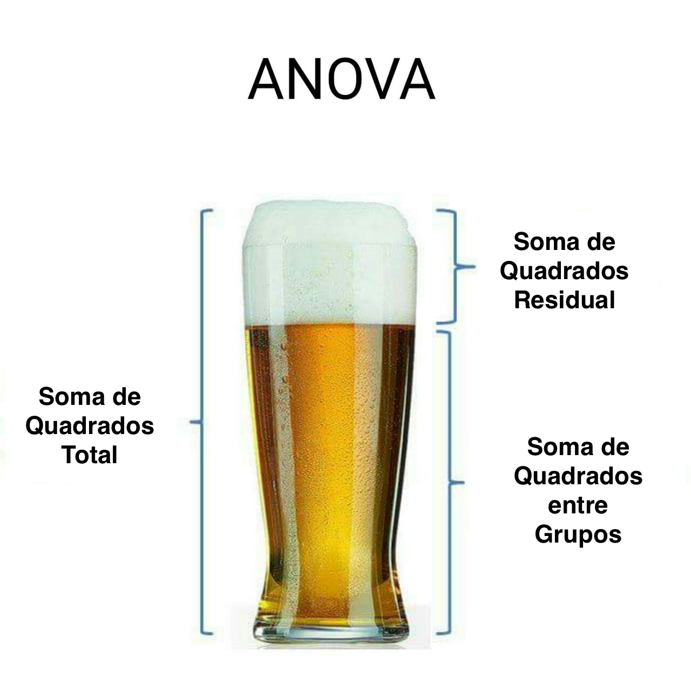
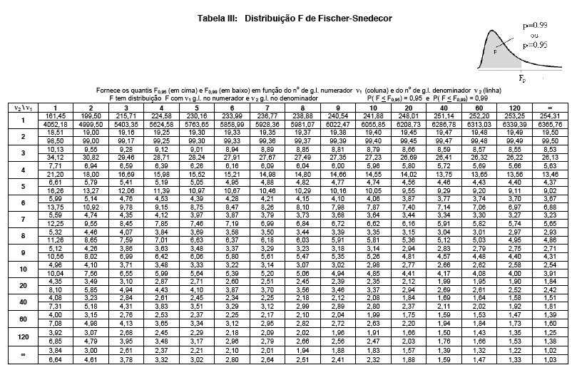
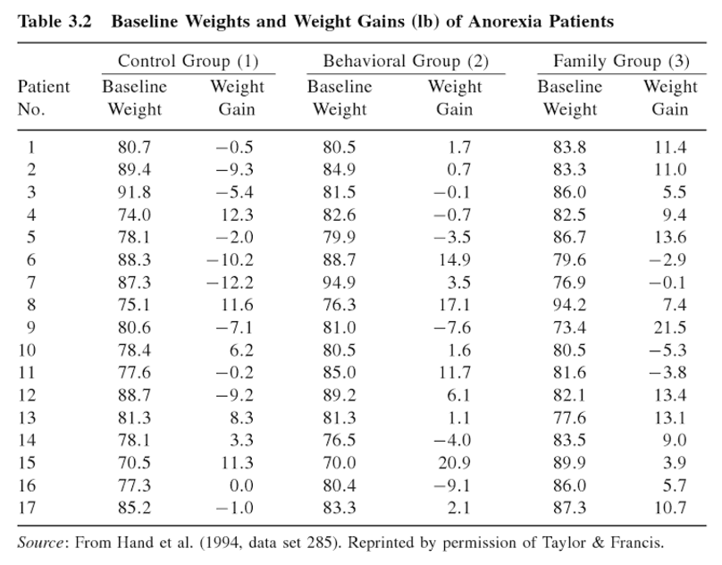

<!-- Definindo duas colunas para os slides. A da esquerda com 70% de largura e a da direita com 30% -->
<style>
.column-left{
  float: left;
  width: 70%;
  text-align: left;
}
.column-right{
  float: right;
  width: 30%;
  text-align: right;
}
</style>

```{r setup, include=FALSE}
library(knitr)
options(knitr.kable.NA = '')
opts_chunk$set(echo=FALSE)

library(RColorBrewer)
mycol <- brewer.pal(8, "Dark2")
```

# Análise de Variância (ANOVA)

## Introdução {.build}

Já vimos anteriormente como testar se existe diferença entre duas médias $\mu_1$ e $\mu_2$ de duas populações independentes. Ou seja:

$$H_0: \mu_1=\mu_2 \quad \mbox{vs} \quad  H_1: \mu_1 \neq \mu_2$$

Considerando o caso das variâncias iguais e desconhecidas, usamos $S_p^2$ como estimador da variância $\sigma^2$ e temos a estatística do teste: 
$$T= \frac{\bar{X} - \bar{Y}}{ \sqrt{S_p^2 ( \frac{1}{n} + \frac{1}{m}} )} \stackrel{H_0}{\sim} t_{n+m-2}.$$

Mas e se quiséssemos comparar as médias de 3 ou mais populações (grupos)?


## Exemplo: Tratamento para Anorexia {.build}

Foi conduzido um experimento para comparar três terapias no tratamento de anorexia em meninas adolescentes para ajudá-las a ganhar peso. As terapias foram: controle, comportamental e de família.

<div class="column-right">

</div>

Poderíamos comparar o ganho médio de peso comparando as terapias duas a duas, certo?

No entanto, isso não é muito viável (e nem a forma mais eficiente) quando temos muitos grupos.

A técnica estatística adequada para esse tipo de problema, com a qual pode-se comparar se as médias de várias populações (grupos) são todas iguais com um único teste é chamada de **Análise de Variância (ANOVA)**.


## Análise de Variância - ANOVA  {.build}
**Objetivo:** Comparar se as médias de 3 ou mais populações (grupos) são iguais.

**Hipóteses:**
$$\begin{aligned} 
& H_0: \mbox{as médias são as mesmas para todos os grupos} \\ 
& H_1: \mbox{pelo menos uma média é diferente das demais}
\end{aligned}
$$

Em termos estatísticos:
$$\begin{aligned} 
& H_0: \mu_1=\mu_2=\ldots=\mu_k \\ 
& H_1: \mbox{pelo menos uma média é diferente das demais}
\end{aligned}
$$

A **estatística do teste**, chamada de F, é conceitualmente o seguinte:
$$F = \frac{\mbox{Variação entre as médias amostrais dos grupos}}{\mbox{Variação média dentro dos grupos}}$$


## ANOVA - Condições {.build}

Devemos checar três condições nos dados onde iremos realizar a ANOVA:

* as observações são independentes dentro dos grupos e entre os grupos;

* os dados dentro de cada grupo são aproximadamente normais; e 

* a variância é aproximadamente constante entre os grupos.


## Detalhes da ANOVA {.build}

Um conceito fundamental em Análise de Variância é que a variação total dos dados, considerando todas as amostras como vindas de uma única população, pode ser separadas em duas partes:

* variação devido às diferenças entre as médias dos grupos

* variação das observações dentro de cada grupo

Ou seja, escrevendo como uma equação:

$$\mbox{Variação Total = Variação Entre Grupos + Variação Dentro dos Grupos}$$

Iremos ver agora como medir cada uma dessas variações.


## Decomposição da Variação Total

<center></center>


## Estrutura dos Dados {.build}

Grupos |  Observações |  Média
------ |:------------:|:------:
Grupo 1    | $X_{11}, X_{12}, X_{13}, \ldots, X_{1n}$ | $\bar{X}_1$
Grupo 2    | $X_{21}, X_{22}, X_{23}, \ldots, X_{2n}$ | $\bar{X}_2$
 $\vdots$  | $\vdots$ | $\vdots$
Grupo k    | $X_{k1}, X_{k2}, X_{k3}, \ldots, X_{kn}$ | $\bar{X}_k$

Veja que a média e variância amostral para cada grupo são calculadas como:
$$\bar{X}_i = \frac{1}{n} \sum_{j=1}^n X_{ij} \quad \mbox{e} \quad s_i^2 = \frac{1}{n-1}  \sum_{j=1}^n (X_{ij} - \bar{X}_i)^2$$


## Notação {.build}

Considere a seguinte notação:

$k$: número de populações ou grupos

$n$: tamanho de cada grupo

$X_{ij}$: a $j$-ésima observação dentro do $i$-ésimo grupo, $i=1, \ldots, k$ e $j=1,\ldots,n$

$\bar{X}_i$: média amostral do $i$-ésimo grupo

$\bar{X}$: média amostral considerando todas as observações como parte de um 
único grupo/população.

$s_i$: desvio padrão amostral do $i$-ésimo grupo


## Variação Total {.build}
A variação total das observações é chamada de **Soma de Quadrados Total** ou $SQ_T$ e é calculada como o numerador da variância amostral se todas as observações fossem combinadas em um único grupo. Ou seja,
$$SQ_T = \sum_{i=1}^k \sum_{j=1}^n (X_{ij} - \bar{X})^2$$

Analiticamente pode-se mostrar que:
$$\begin{aligned} 
SQ_T = \sum_{i=1}^k \sum_{j=1}^n (X_{ij} - \bar{X})^2  &= n \sum_{i=1}^k (\bar{X_i} - \bar X)^2 + \sum_{i=1}^k \sum_{j=1}^n (X_{ij} - \bar{X}_i)^2 \\
&= SQ_G + SQ_E
\end{aligned}
$$

Veremos agora o que são $SQ_G$ e $SQ_E$.


## Variação Entre Grupos {.build}

A variação entre as médias dos grupos é chamada de **Soma de Quadrados Entre Grupos** ou $SQ_G$ e é calculada da seguinte forma:

$$SQ_G = n \sum_{i=1}^k (\bar{X_i} - \bar X)^2 = n(\bar{X}_1 - \bar X)^2+ \ldots + n(\bar{X}_k - \bar X)^2$$

Veja que é a soma ponderada das diferenças entre as médias dos grupos $\bar{X}_i$ e a média geral $\bar X$ ao quadrado.

O numerador da estatística $F$ é chamado de **Quadrado Médio Entre Grupos** ou $QM_G$ e pode ser visto como sendo a variância amostral das médias dos grupos:
$$QM_G = \frac{SQ_G}{k-1}$$


## Variação Dentro dos Grupos {.build}
A variação das observações dentro dos grupos é chamada de **Soma de Quadrados do Erro** ou $SQ_E$ e é calculada da seguinte forma:
$$SQ_E = \sum_{i=1}^k \sum_{j=1}^n (X_{ij} - \bar{X}_i)^2 =  \sum_{i=1}^k (n-1) s^2_i$$

Ou seja, é a soma ponderada das variâncias amostrais para o $i$-ésimo grupo.

O denominador da estatística $F$ é chamado de **Quadrado Médio do Erro** ou $QM_E$ e é a estimativa da variância populacional para $k$ grupos:
$$QM_E = \frac{SQ_E}{k(n-1)} = \frac{(n-1) s^2_1  + \ldots + (n-1) s^2_k}{kn-k}$$


## Teste de Igualdade das Médias para $k$ Grupos {.build}

Resumindo, estamos interessados em testar as hipóteses:
$$\begin{aligned} 
& H_0: \mu_1=\mu_2=\ldots=\mu_k \\ 
& H_1: \mbox{pelo menos uma média é diferente das demais}
\end{aligned}
$$

A **estatística do teste** é dada por:
$$F = \frac{QM_G}{QM_E} = \frac{\frac{SQ_G}{k-1}}{\frac{SQ_E}{k(n-1)}}$$

Sob a hipótese $H_0$ de igualdade das médias, a estatística do teste segue uma distribuição $F$ com $k-1$ graus de liberdade no númerador e $k(n-1)$ graus de liberdade no denominador. Ou seja,
$$F \stackrel{H_0}{\sim} F_{k-1, k(n-1)}$$


## Tabela F {.smaller}
Os valores críticos da distribuição $F$ para $\alpha=0.05$ ou $\alpha=0.01$ estão na tabela abaixo. As linhas e colunas representam os graus de liberdade do denominador ($\nu_2$) e numerador ($\nu_1$), respectivamente.

<center></center>


## Teste de Igualdade das Médias para $k$ Grupos {.build}

**Valor Crítico**: Para um nível de significância $\alpha$, encontrar o valor crítico $F_{crit}$ na tabela $F$ com $k-1$ graus de liberdade no numerador e $k(n-1)$ graus de liberdade no denominador tal que $P(F_{k-1, k(n-1)} \geq F_{crit}) = \alpha.$


```{r, echo=FALSE, fig.align="center", fig.width=6, fig.height=2.8, message=FALSE}
library(openintro, verbose = FALSE)
data(COL)
alpha <- 0.10
df1 <- 3
df2 <- 18

ymax <- max(df(0:6, df1, df2))/2

x <- seq(0, 6, length.out = 300)
y <- df(x, df1, df2)

par(mar = c(4, 2, 2, 1))
dfs <- paste("k-1, k(n-1)")
plot(x, y, type = 'l', axes = FALSE, xlim = c(0, 5), lwd=2, 
       main = bquote("Distribuição "* F[.(dfs)]), xlab="", ylab="")
abline(h = 0)
axis(1)

fcrit <- round(qf(1-alpha, df1, df2), 3)  
axis(1, at=fcrit, label= bquote(F[crit]))

these <- which(x >= fcrit)
x <- x[c(these[1], these, rev(these)[1])]
y <- c(0, y[these], 0)
polygon(x, y, col = COL[1])

text(fcrit+1.5, ymax/2, labels= bquote("área = "* P(F[.(dfs)] >= F[crit]) == alpha), pos = 3, cex = 1.2, col = COL[1])
```


**Conclusão**: Rejeitamos $H_0$ se $F_{obs} \geq F_{crit} = F_{k-1, k(n-1), \alpha}$ ou, de forma equivalente, se o p-valor for menor que $\alpha$.


## Tabela ANOVA {.build}

Tudo o que discutimos até agora pode ser resumido na tabela abaixo. Essa tabela é chamada de **Tabela ANOVA**

Fonte de Variação | Graus de Liberdade | Soma de Quadrados | Quadrado Médio | Estatística F
----------------- | ------------------:| -----------------:| --------------:| ------------:
Grupos (Entre)    | $k-1$    | $SQ_G$ | $QM_G$ | $\displaystyle F = \frac{QM_G}{QM_E}$ 
Erro (Dentro)     | $k(n-1)$ | $SQ_E$ | $QM_E$ | 
Total             | $kn-1$   | $SQ_T$ |        |  

Na prática, basta calcular $SQ_T$ e $SQ_G$ e obter a $SQ_E$ por subtração:
$$SQ_T = SQ_G + SQ_E \qquad \Longrightarrow \qquad SQ_E = SQ_T - SQ_G$$

## Tratamento para Anorexia {.build}

Voltando ao estudo para comparar três terapias no tratamento de anorexia em meninas adolescentes para ajudá-las a ganhar peso. 

<div class="column-right">

</div>

As terapias foram: controle, comportamental e de família.

No total, 51 meninas participaram do estudo. Para cada tipo de terapia foram escolhidas 17 meninas aleatoriamente. 

A variável de interesse é ganho de peso (lb).


## Tratamento para Anorexia

<center>

</center>


## Tratamento para Anorexia

```{r}
dados <- read.table("dados/DadosAnorexia.txt", header=TRUE)
colnames(dados) <- c("Terapia", "Peso0", "Ganho")
levels(dados$Terapia) <- c("Controle", "Comportamental", "Família")

stats <- with(dados, tapply(Ganho, Terapia, function(x) c(n=17, summary(x), SD=sd(x))))
stats <- rbind(stats$Controle, stats$Comportamental, stats$Família)
rownames(stats) <- c("Controle", "Comportamental", "Família")

kable(stats, col.names = c("n", "Mínimo", "Q1", "Mediana", "Média", "Q3", "Máximo", "SD"),
      digits=2, caption="Estatísticas Descritivas do Ganho de Peso por Grupo de Terapia")
```


## Tratamento para Anorexia {.build}

<div, class="column-left">
```{r, fig.width=4, fig.height=3.5}
library(ggplot2)
g1 <- ggplot(dados, aes(x=Terapia, y=Ganho)) + 
    ylab("Ganho de Peso (em lb)") + 
    theme(text=element_text(size=12))

g1 + geom_boxplot(aes(fill=Terapia), show.legend=FALSE) + 
    ggtitle("Boxplot")
```
</div>

<div, class="column-right">
```{r, fig.width=4, fig.height=3.5}
g1 + geom_point(aes(colour=Terapia, group=Terapia), show.legend=FALSE, size=2, alpha=0.6) +
    geom_point(stat="summary", fun.y=mean, size=2) + 
    ggtitle("Gráfico de Pontos")
```
</div>


## Tratamento para Anorexia - ANOVA {.build}

```{r, echo=FALSE}
fit <- lm(Ganho ~ Terapia, data=dados)
anovafit <- anova(fit)
pvalor <- round(anovafit$`Pr(>F)`[1], 4)
df <- anovafit$Df[1:2]
F0 <- round(anovafit$`F value`[1], 3)

alpha <- 0.05
fcrit <- round(qf(1-alpha, df1=df[1], df2=df[2]), 3) 

anovafit[3, 1:2] <- colSums(anovafit[, 1:2])
rownames(anovafit) <- c("Terapia", "Erro", "Total")

kable(anovafit, digits = c(0, 2, 2, 2, 5), 
      colnames = c("GL", "SQ", "QM", "F", "p-valor"), 
      caption="Tabela ANOVA para comparação entre Terapias")
```

Pela tabela ANOVA (F=3.85 e p-valor=0.028) temos evidência que pelo menos uma das médias do ganho de peso dentre os três grupos de terapia difere significativamente das demais.

Mas qual seria a terapia que difere da demais? Ou quais terapias diferem entre si?


## ANOVA - Distribuição F {.build}

```{r, fig.align="center", fig.width=6, fig.height=4}
library(openintro, verbose = FALSE)
data(COL)
source("../functions/FTail.R")
xobs <- F0

ymax <- max(df(0:6, df1=df[1], df2=df[2]))/2

par(mar = c(3, 2, 3, 1))
FTail(fcrit, df[1], df[2], c(0, 6), col = COL[1], xlab="")

arrows(fcrit, ymax, fcrit, ymax/3, 0.1, col = COL[1])
text(fcrit, ymax, labels= bquote(F[.(paste(df[1], df[2], alpha, sep=","))] == .(fcrit)), 
     pos = 3, cex = 1.2, col = COL[1])
text(fcrit + 2, 0.01, labels= bquote("área = "* .(alpha)), pos = 3, cex = 1.2, col = COL[1])

axis(1, at=xobs, label= bquote(F[obs]))
```

**Conclusão:** Para $\alpha = `r alpha`$, como $F_{obs}= `r F0` > `r fcrit` = F_{crit},$ rejeitamos a hipótese de que as médias de ganho de peso para todas as terapias são iguais.


## Testes de Comparações Múltiplas {.build}

Após detectar pela tabela ANOVA que pelo menos uma média difere das demais, podemos aplicar um dos testes de comparações múltiplas.

Existem alguns testes de médias e cada um tem uma particularidade. Os mais importantes são:

* **Teste LSD Fisher:** Compara todos os possíveis de pares de médias, controlando a probabilidade de erro tipo I de cada teste individualmente. 

* **Teste de Tukey:** Compara todos os possíveis de pares de médias, controlando a probabilidade de erro tipo I global. 

* **Teste de Dunnett:** Compara todas as médias em relação a um grupo controle.


## Teste de Tukey {.build}

É o teste de comparações múltiplas mais utilizado!

Após determinarmos a diferença mínima significativa (ou Honest Significant Difference - HSD), podemos julgar se as médias são iguais ou não. 

Em termos práticos, esse valor nos dá uma margem de igualdade, pois se a diferença entre dois tratamentos for maior do que isso, os médias são diferentes. Isto é, dizemos que duas médias $\mu_i$ e $\mu_j$ são estatisticamente diferentes se:
$$\left|\overline{y}_{i \cdot} - \overline{y}_{j \cdot} \right| > T_\alpha,$$
onde $\displaystyle T_\alpha = q_\alpha(k, k(n-1)) \sqrt{\frac{QM_E}{n}}$
e $q_\alpha(k, k(n-1))$ é um valor tabelado obtido na Tabela de Tukey.


## Teste de Tukey - Anorexia

```{r}
## MSE e dfe
mse <- round(anovafit$`Mean Sq`[2], 2)
dfe <- anovafit$Df[2]
    
## Nível de significância dos testes
alpha <- 0.05
    
## Teste de Tukey
a <- 3 # número de tratamentos
n <- 17
qalpha <- round(qtukey(1-alpha, a, df=dfe), 2)
Talpha <- round(qalpha*sqrt(mse/(n)), 2)
```

Calculando a diferença mínimo significativa:

$$T_\alpha = q_\alpha(k, kn-1) \sqrt{\frac{QM_E}{n}} \quad \Longrightarrow \quad T_{`r alpha`}=`r qalpha` \sqrt{\frac{`r mse`}{`r n`}} = `r Talpha`$$

```{r}
tTukey <- TukeyHSD(aov(Ganho ~ Terapia, data=dados))
kable(tTukey$Terapia, digits = 3, 
      col.names = c("Diferença", "LI", "LS", "p-valor ajustado"),
      caption="Resultado do Teste de Tukey")
```

A única diferença significativa é entre a terapia de família e a controle.


## Teste de Tukey - Anorexia
```{r, fig.align="center"}
par(mar=c(5, 12, 4, 2))
plot(tTukey, las=1)
```


## Exemplo: Qual dieta você faria? {.build}

Uma nutricionista quer comparar a perda de peso para três tipos diferentes de dieta. Ela selecionou 12 de seus pacientes e escolheu 4 ao acaso para fazer cada uma das dietas. Depois de um período de três meses os pacientes foram pesados e a perda de peso (em Kg) foi a seguinte:

```{r, echo=FALSE}
x <- matrix(c(1:4, 7, 9, 5, 7, 9, 11, 7, 10, 15, 12, 18, 16), nrow=4)
colnames(x) <- c("Paciente", "Dieta 1", "Dieta 2", "Dieta 3")
kable(x, align = c("c", "c", "c", "c"))

dieta <- factor(rep(paste("Dieta", 1:3, sep=" "), each=4))
peso <- c(7, 9, 5, 7, 9, 11, 7, 10, 15, 12, 18, 16)
dados <- data.frame(Dieta=dieta, Perda=peso)
```


## Exemplo: Dieta {.build}

```{r, echo=FALSE}
stats <- with(dados, tapply(Perda, Dieta, function(x) c(n=4, summary(x), SD=sd(x))))
stats <- rbind(stats$`Dieta 1`, stats$`Dieta 2`, stats$`Dieta 3`)
rownames(stats) <- levels(dados$Dieta)

kable(stats, col.names = c("n", "Mínimo", "Q1", "Mediana", "Média", "Q3", "Máximo", "SD"),
      digits=2, caption="Estatísticas Descritivas da Perda de Peso por Tipo de Dieta")
```


## Exemplo: Dieta {.build}

```{r, fig.width=4, fig.height=3.5}
g2 <- ggplot(dados, aes(x=Dieta, y=Perda)) + 
    ylab("Perda de Peso (em Kg)") + 
    theme(text=element_text(size=12), axis.text=element_text(size=12)) + xlab("")

g2 + geom_boxplot(aes(fill=Dieta), show.legend = FALSE) + 
    ggtitle("Boxplot")

g2 + geom_point(aes(colour=Dieta, group=Dieta), show.legend = FALSE, size=2) +
    geom_point(stat="summary", fun.y=mean, size=2) + 
    ggtitle("Gráfico de Pontos")
```


## Exemplo: Dieta {.build}
```{r, echo=FALSE}
fit <- lm(Perda ~ Dieta, data=dados)
anovafit <- anova(fit)
pvalor <- round(anovafit$`Pr(>F)`[1], 4)
df <- anovafit$Df[1:2]
F0 <- round(anovafit$`F value`[1], 3)

alpha <- 0.05
fcrit <- round(qf(1-alpha, df1=df[1], df2=df[2]), 3) 

anovafit[3, 1:2] <- colSums(anovafit[, 1:2])
rownames(anovafit) <- c("Dieta (Entre)", "Erro (Dentro)", "Total")
colnames(anovafit) <- c("GL", "SQ", "QM", "F", "p-valor")

kable(anovafit, digits = c(0, 2, 2, 2, 5), caption="Tabela ANOVA para comparação entre Dietas")
```


Para $\alpha=`r alpha`$, olhando na tabela F com `r df[1]` e `r df[2]` graus de liberdadeo, o valor crítico é $F_{crit} = F_{`r df[1]`, `r df[2]`, `r alpha`} = `r fcrit`$.

**Conclusão:** Para $\alpha = `r alpha`$, como $F_{obs}= `r F0` > `r fcrit` = F_{crit},$ rejeitamos a hipótese de que a perda de peso média para todas as dietas são iguais.


## Exemplo: Dieta {.build}
```{r, echo=FALSE, fig.align="center", fig.width=6, fig.height=4}
xobs <- F0

ymax <- max(df(0:6, df1=df[1], df2=df[2]))/2

par(mar = c(4, 2, 3, 1))
FTail(fcrit, df[1], df[2], c(0, 6), col = COL[1], xlab="")

arrows(fcrit, ymax, fcrit, ymax/4, 0.1, col = COL[1])
text(fcrit, ymax, labels= bquote(F[.(paste(df[1], df[2], alpha, sep=","))] == .(fcrit)), pos = 3, cex = 1.2, col = COL[1])
text(fcrit + 1, 0.01, labels= bquote("área = "* .(alpha)), pos = 3, cex = 1.2, col = COL[1])

axis(1, at=xobs, label= bquote(F[obs]))
```

**Conclusão:** Para $\alpha = `r alpha`$, como $F_{obs}= `r F0` > `r fcrit` = F_{crit},$ rejeitamos a hipótese de que a perda de peso média para todas as dietas são iguais.


## Atividade
<center>

</center>


## Leituras

* [OpenIntro](https://www.openintro.org/stat/textbook.php): seção 5.5
* Magalhães: seção 9.4
* [Plasma antioxidants from chocolate (Serafini et al., Nature 424, 1013 (28 August 2003)](https://www.nature.com/nature/journal/v424/n6952/pdf/4241013a.pdf)


##

Slides produzidos pelos professores:

* Samara Kiihl

* Tatiana Benaglia

* Benilton Carvalho

* Rafael Maia
